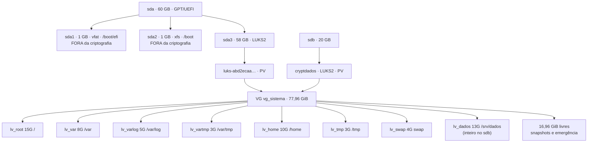

# INSTALL.md — Instalação segura do Red Hat Enterprise Linux

Guia reproduzível · Grupo 1 · CP02 Sistemas Operacionais Linux — FIAP

Este documento registra **o que foi executado de fato** no laboratório do grupo, com os valores reais e as saídas obtidas. Partindo de um hipervisor vazio, ele leva ao mesmo ambiente: RHEL 10.2 com **LVM sobre LUKS2** em dois discos, partições separadas com opções restritivas, SELinux em Enforcing do início ao fim e serviço SSH endurecido na porta 6969, com auditoria automatizada.

Cada etapa aponta o arquivo de `evidencias/` que prova o resultado.

---

## Sumário

- [0. Antes de começar](#0-antes-de-começar)
- [1. Preparo da mídia](#1-preparo-da-mídia)
- [2. Criação da máquina virtual](#2-criação-da-máquina-virtual)
- [3. Esquema de particionamento](#3-esquema-de-particionamento)
- [4. Instalação](#4-instalação)
- [5. Primeiro boot e validação](#5-primeiro-boot-e-validação)
- [6. Rede, subscrição e atualização](#6-rede-subscrição-e-atualização)
- [7. Opções de montagem](#7-opções-de-montagem)
- [8. Segundo disco e ciclo de vida do LVM](#8-segundo-disco-e-ciclo-de-vida-do-lvm)
- [9. Serviço SSH endurecido](#9-serviço-ssh-endurecido)
- [10. Política de criptografia e teste pós-quântico](#10-política-de-criptografia-e-teste-pós-quântico)
- [11. Script de auditoria](#11-script-de-auditoria)
- [12. Evidências](#12-evidências)
- [13. Troubleshooting](#13-troubleshooting)
- [Apêndice A — Valores do laboratório](#apêndice-a--valores-do-laboratório)
- [Apêndice B — Recuperação](#apêndice-b--recuperação)

---

## 0. Antes de começar

### Convenções

| Notação | Significado |
|---|---|
| `$` | comando no servidor, como `nighthawk` (usuário administrativo) |
| `$ sudo ...` | comando no servidor que exige privilégio |
| `PS>` | comando no PowerShell do notebook (cliente Windows 11) |
| `<VALOR>` | substituir pelo valor do Apêndice A |

### Pré-requisitos

- VirtualBox com virtualização por hardware habilitada no host
- 60 GB livres no host para o disco principal + 20 GB para o segundo disco
- Conta em `developers.redhat.com` com a Red Hat Developer Subscription ativa
- Cliente OpenSSH no host (já vem no Windows 10/11)

### Regras que não se negociam

1. **Anote a passphrase do LUKS em papel.** Não existe recuperação.
2. **Tire snapshot nos pontos marcados 📸.** O ambiente vai quebrar em algum momento.
3. **Nunca feche a sessão atual** antes de validar uma mudança de SSH em outra sessão. O console do VirtualBox é a via de socorro.
4. **Tudo que toca disco, LUKS, LVM, `/etc/ssh` ou `/etc/crypttab` exige `sudo`.** Sem ele os erros são enganosos (ver seção 13).
5. **`>` cria/sobrescreve, `>>` acrescenta.** Ao gravar várias saídas no mesmo arquivo de evidência, só a primeira linha usa `>`.

---

## 1. Preparo da mídia

1. `developers.redhat.com` → *Downloads* → *Red Hat Enterprise Linux* → **x86_64**, imagem **Binary DVD**.
2. Anote o SHA-256 publicado na página.
3. Confira a imagem:

```powershell
PS> Get-FileHash .\<ARQUIVO_ISO> -Algorithm SHA256
```

O hash precisa ser idêntico ao publicado. Guarde a saída em `evidencias/00-hash-iso.txt`.

---

## 2. Criação da máquina virtual

| Parâmetro | Valor | Local no VirtualBox |
|---|---|---|
| Nome | `RedHat Enterprise Linux 10` | Nova VM |
| Tipo | Linux / Red Hat (64-bit) | Nova VM |
| Memória | 2048 MB (host com 8 GB) | Sistema → Placa-mãe |
| **EFI** | **Habilitado** | Sistema → Placa-mãe |
| **Dispositivo apontador** | **Tablet USB** | Sistema → Placa-mãe |
| Processadores | 2 | Sistema → Processador |
| Disco principal | 60 GB, VDI, dinamicamente alocado | Armazenamento → Controladora SATA |
| **Adaptador 1** | **NAT** (internet: registro e `dnf`) | Rede |
| **Adaptador 2** | **Host-Only** (acesso SSH a partir do notebook) | Rede |
| Controlador USB | Habilitado, USB 1.1 (OHCI) sem Extension Pack | USB |
| Controlador gráfico | VMSVGA | Tela |
| Áudio | Desabilitado (recomendado: hardware desnecessário num servidor) | Áudio |

**Por que duas placas:** Host-Only cria uma rede privada só entre o notebook e a VM, sem internet. NAT dá internet, mas o notebook não alcança a VM sem redirecionamento de portas. Com as duas, o `dnf` funciona pela NAT (`10.0.2.x`) e o SSH chega pela Host-Only (`192.168.56.103`), sem depender da rede da faculdade no dia da apresentação.

**Por que Tablet USB:** com *Mouse PS/2* o ponteiro precisa ser capturado pela VM, e no laboratório os cliques não chegavam ao instalador. O tablet dá ponteiro absoluto e depende do controlador USB habilitado.

> ⚠️ **Não adicione o segundo disco agora.** Ele entra na etapa 8, depois da instalação.

Monte a ISO na controladora IDE e inicie a VM.

---

## 3. Esquema de particionamento

Validado no marco D-14, antes de qualquer instalação. Estado final, depois da etapa 8:



### Justificativa das decisões

| Decisão | Justificativa | Risco residual |
|---|---|---|
| LVM **sobre** LUKS (um container por disco) | Uma passphrase no boot; todo LV novo nasce criptografado; metadados do VG protegidos | Header do LUKS corrompido compromete o VG → backup do header e segundo keyslot (etapa 5) |
| `/boot` e `/boot/efi` fora do LUKS | O GRUB precisa ler kernel e initramfs antes de existir qualquer chave | Kernel e initramfs em claro; adulteração offline possível — mitigável com Secure Boot |
| `/tmp` e `/var/tmp` com `nodev,nosuid,noexec` | Bloqueia execução direta de payload gravado em diretório gravável por todos | Não bloqueia `bash script.sh` (testado, etapa 7) |
| `/var/log` com `nodev,nosuid,noexec` | Integridade da trilha de auditoria; impede a área de virar staging | — |
| `/home` com `nodev,nosuid` | Impede binário SUID criado por usuário comum | Sem `noexec`: usuário legítimo precisa executar scripts |
| `/var` só com `nodev` | Isola crescimento de dados de serviço | `noexec` aqui quebraria serviços e containers |
| `/boot` com `nodev,nosuid` | Área de boot não precisa de dispositivos nem SUID | — |
| Espaço livre no VG | Sem ele não há snapshot nem como estender um volume cheio a quente | Disco aparentemente subutilizado |
| Segundo disco também em LUKS | `pvcreate` direto em `/dev/sdb` deixaria parte do VG em claro | Arquivo de chave em `/etc` (dentro do LUKS principal) |

---

## 4. Instalação

> Foi usado o instalador gráfico (Anaconda) em português. Um caminho alternativo, todo por linha de comando, está em `LAYOUT-CONSOLE.md`.

### 4.1 Telas iniciais

1. Menu de boot: **Instalar Red Hat Enterprise Linux 10.2**.
2. Idioma: Português (Brasil) · Teclado: `br`.
3. *Hora e data*: `America/Sao_Paulo`.
4. *Seleção de programas*: **Instalação mínima**. ⚠️ O padrão proposto é *Server with GUI* — troque; o enunciado exige ambiente sem interface gráfica.
5. *Rede e nome do host*: ative **as duas** placas e defina o nome `rhel-grupo1`.

### 4.2 Entrar no particionamento manual

6. *Destino da instalação* → selecione o disco de 60 GiB.
7. *Configuração de armazenamento*: **Personalizado** → **Pronto**.

> ℹ️ A opção *Criptografar meus dados* **desaparece** ao marcar *Personalizado*. É comportamento do instalador: ela pertence ao particionamento automático. No layout manual a criptografia é definida no grupo de volume (etapa 14) e a senha é pedida ao sair da tela.

### 4.3 Descartar o layout automático

O instalador propõe `rhel-root`, `rhel-home` e `rhel-swap` — sem criptografia, com o VG a `0 B livre` e sem `/var`, `/var/log`, `/var/tmp` e `/tmp` separados. **Não serve.**

8. **Descartar todas as alterações** (canto inferior direito).
9. Remova com **−** o que restar na lista da esquerda.

**Esperado:** *ESPAÇO DISPONÍVEL* ≈ *ESPAÇO TOTAL* (60 GiB).

### 4.4 As duas partições fora da criptografia

Para cada uma: **+** → ponto de montagem → **capacidade sempre preenchida** → *Adicionar ponto de montagem* → ajustar o painel da direita → **Atualizar configurações**.

| # | Ponto de montagem | Capacidade | Tipo de dispositivo | Sistema de arquivos |
|---|---|---|---|---|
| 10 | `/boot/efi` | `1 GiB` | Partição padrão | EFI System Partition |
| 11 | `/boot` | `1 GiB` | Partição padrão | `xfs` |

*Criptografar* **desmarcado** nas duas.

> ⚠️ **Capacidade em branco = volume com todo o espaço livre.** O próximo **+** falha com *"Não foi possível alocar o esquema de partição solicitado"*.

### 4.5 O passo que define todo o esquema

12. **+** → `/` → `15 GiB` → *Adicionar ponto de montagem*.
13. Com `/` selecionado: *Tipo de dispositivo* **LVM**, *Sistema de arquivos* `xfs`, *Grupo de volume* → **Modificar...**
14. 🔴 Janela **CONFIGURAR GRUPO DE VOLUME**:
    - *Nome*: `vg_sistema`
    - **Criptografar: MARCADO**
    - *Política de tamanho*: **Automático** por enquanto (troca na etapa 23)
    - **Salvar**
15. *Nome* do volume: `lv_root` → **Atualizar configurações**.

> **Por que no grupo e não em cada volume:** *Criptografar* no grupo de volume cifra o volume físico e, com ele, todos os volumes lógicos — um container, uma senha. *Criptografar* no painel de cada volume faz o oposto: um LUKS por volume, várias senhas, metadados do VG expostos. Não há conversão; errar é reinstalar.
>
> **Se *Criptografar* estiver cinza:** o grupo já foi materializado com volumes. Descarte tudo e recomece: o VG criptografado nasce antes dos demais volumes.

### 4.6 Os seis volumes restantes

| # | Ponto de montagem | Capacidade | Tipo | Grupo de volume | Sistema de arquivos | Nome |
|---|---|---|---|---|---|---|
| 16 | `/var` | `8 GiB` | LVM | `vg_sistema` | `xfs` | `lv_var` |
| 17 | `/var/log` | `5 GiB` | LVM | `vg_sistema` | `xfs` | `lv_varlog` |
| 18 | `/var/tmp` | `3 GiB` | LVM | `vg_sistema` | `xfs` | `lv_vartmp` |
| 19 | `/home` | `10 GiB` | LVM | `vg_sistema` | `xfs` | `lv_home` |
| 20 | `/tmp` | `3 GiB` | LVM | `vg_sistema` | `xfs` | `lv_tmp` |
| 21 | swap | `4 GiB` | LVM | `vg_sistema` | swap | `lv_swap` |

Em cada um: grupo de volume **`vg_sistema`**, *Criptografar* **desmarcado** (a criptografia já está no grupo), *Nome* preenchido.

### 4.7 Reservar o espaço livre do VG

22. Só agora, com os nove itens criados, selecione um volume LVM → **Modificar...**
23. *Política de tamanho*: **Tão grande quanto possível** → **Salvar**.

Com *Automático*, o VG encolhe até caber nos volumes e sobra zero. Com *Tão grande quanto possível*, ele ocupa os ~58 GiB do container: os volumes somam 48 GiB e a diferença fica **livre dentro do VG**, onde o snapshot da etapa 8.5 precisa dela.

> O contador *ESPAÇO DISPONÍVEL* do rodapé cai para ~2 MiB nesse momento. Está certo: ele mede espaço livre **no disco**, não no grupo de volume.

### 4.8 Senha e confirmação

24. **Pronto** → janela **SENHA DE CRIPTOGRAFIA DE DISCO** → digite duas vezes → **Salvar senha**.

> ⚠️ Nesta janela o teclado é **americano** e não pode ser trocado. Use só `A-Z a-z 0-9 - _ .`; caracteres do ABNT2 saem diferentes e só se descobre no primeiro boot.

25. **SUMÁRIO DE ALTERAÇÕES**: deve haver criação de LUKS em `sda3` e **nenhuma** em volume individual → **Aceitar alterações**.

### 4.9 KDUMP sobre disco criptografado

No resumo, **KDUMP** aparece com o aviso *"Kdump may require extra setup for encrypted devices"*.

O kdump reserva memória para um segundo kernel, que assume após uma pane e grava a memória em `/var/crash`. Aqui `/var` está dentro do LUKS: o kernel de captura teria de destravar o container sem ninguém para digitar a senha, e o LUKS2 usa **argon2id**, função propositalmente cara em memória — os dois keyslots deste laboratório custam 139 MiB e 194 MiB (ver `01-luks-sda3.txt`), mais do que a reserva padrão do kdump.

| Opção | Como | Quando faz sentido |
|---|---|---|
| A · Desativar | KDUMP → desmarcar *Ativar kdump* → **Pronto** | Laboratório com pouca RAM |
| B · Aumentar a reserva | Após o boot: `kdumpctl estimate` e `grubby --update-kernel=ALL --args="crashkernel=<valor>"` | Demonstrar o conflito na prática |
| C · Destino remoto | `/etc/kdump.conf` com destino SSH/NFS fora do disco cifrado | Produção |
| **D · Automático (escolhida)** | Deixar a reserva em *Automático* | RHEL 10: a chave de volume é reaproveitada, sem senha e sem reserva extra |

**O que foi feito:** KDUMP ficou em **automático**. Depois da instalação, o `/etc/crypttab` do `sda3` saiu com a opção

```
link-volume-key=@u::%logon:kdump-cryptsetup:vk-abd2ecaa-e5f8-4f26-a7da-149af42ec0cd
```

No boot, o systemd guarda a **chave de volume** do LUKS no keyring do kernel; o kdump a reaproveita no kernel de captura. O kernel de captura não precisa da passphrase nem de rodar o argon2id — que, segundo os autores da solução, exigiria reservar cerca de 1,3 GB em vez dos 256 MB padrão. Fonte: série de patches *"Support kdump with LUKS encryption by reusing LUKS volume keys"* (Red Hat), resumida no [LWN](https://lwn.net/Articles/1019780/). 📁 `20-segundo-disco.txt` (seção `crypttab`), `32-kdump.txt`

Resultado na VM (📁 `32-kdump.txt`, 23/09):

```
active
kdump: Kdump is operational
kdump: Notice: No vmcore creation test performed!
kdump: Reserved 256MB memory for crash kernel
crashkernel=2G-64G:256M,64G-:512M
```

A reserva é a **padrão** (256 MB para máquinas de 2 a 64 GB): o disco cifrado não exigiu memória extra. Esses 256 MB saem dos 2 GB da VM.

> **Limite conhecido:** não provocamos um crash para testar o dump — o próprio `kdumpctl` avisa *"No vmcore creation test performed"*. A chave de volume fica na memória reservada ao kdump — como já fica na memória do kernel enquanto o disco está aberto.

26. Abra **KDUMP**, aplique a opção escolhida (o grupo deixou em automático) e clique em **Pronto** (visitar a tela libera *Iniciar a instalação*). Registre a escolha no Apêndice A.

### 4.10 Usuários e instalação

27. **Conta root**: *Habilitar conta root*, senha forte, e **"Permitir login SSH root com senha" DESMARCADO**. Essa caixa grava `PermitRootLogin yes` num drop-in de `/etc/ssh/sshd_config.d/`. A senha de root serve ao console e ao modo de emergência (necessário se o `fstab` quebrar), não ao acesso remoto.
28. **Criação de usuário**: `nighthawk`, marcado como administrador (entra no grupo `wheel`).
29. **Iniciar a instalação** → *Reiniciar o sistema* → remova a ISO.

> Nada é gravado no disco até a etapa 29.

---

## 5. Primeiro boot e validação

O boot pede a passphrase do LUKS no console.

### Checkpoint 1 — o esquema está certo?

```bash
$ lsblk -f
```

Obtido no laboratório — **um único nó `crypt`**, com o VG abaixo dele:

```
sda
├─sda1                                    /boot/efi
├─sda2                                    /boot
└─sda3                                    crypto_LUKS
  └─luks-abd2ecaa-e5f8-4f26-a7da-149af42ec0cd   crypt
    ├─vg_sistema-lv_root                  /
    ├─vg_sistema-lv_swap                  [SWAP]
    ├─vg_sistema-lv_tmp                   /tmp
    ├─vg_sistema-lv_home                  /home
    ├─vg_sistema-lv_vartmp                /var/tmp
    ├─vg_sistema-lv_varlog                /var/log
    └─vg_sistema-lv_var                   /var
```

❌ `crypt` dentro de cada LV = esquema invertido → reinstalar.

### Checkpoint 2 — LUKS2, LVM e SELinux

```bash
$ sudo cryptsetup luksDump /dev/sda3 | head -20
$ sudo cryptsetup luksDump /dev/sda3 | grep -iE 'pbkdf|memory|threads'
$ sudo vgs -o vg_name,vg_size,vg_free
$ getenforce
```

Obtido:

| Item | Valor |
|---|---|
| Versão | LUKS **2** |
| Cifra | `aes-xts-plain64`, chave de **512 bits** (AES-256 em XTS) |
| PBKDF | **argon2id** |
| Flags | `allow-discards` (repasse de TRIM, ligado pelo Anaconda) |
| VG | `vg_sistema`, 57,98 GiB, **VFree 9,98 GiB** |
| SELinux | **Enforcing** |

> **Sobre `allow-discards`:** melhora desempenho e recuperação de espaço, mas revela no disco cifrado quais blocos estão em uso. Aceito no laboratório; decisão registrada.

### Checkpoint 3 — nome, alvo de boot e sessão

```bash
$ sudo hostnamectl set-hostname rhel-grupo1
$ hostnamectl
$ systemctl get-default          # esperado: multi-user.target
$ exec bash                      # o prompt só mostra o nome novo numa sessão nova
```

### 🔴 Proteção do header do LUKS

```bash
$ sudo mkdir -p /root/luks
$ sudo cryptsetup luksHeaderBackup /dev/sda3 --header-backup-file /root/luks/sda3-header.img
$ sudo chmod 600 /root/luks/sda3-header.img
$ sudo cryptsetup luksAddKey /dev/sda3           # segundo keyslot, passphrase de reserva
$ sudo cryptsetup open --test-passphrase /dev/sda3 && echo OK   # testar as duas senhas
```

- **Refaça o backup do header depois de adicionar a chave.** Restaurar um header antigo restaura também os keyslots antigos.
- O arquivo de header + uma passphrase decifram o disco: guarde **fora** da VM e **fora** do repositório.

> 📸 Snapshot — instalação limpa · 📁 `01-luks-sda3.txt`, `05-sistema.txt`

---

## 6. Rede, subscrição e atualização

```bash
$ ip -br a                       # enp0s3 = NAT (10.0.2.x) · enp0s8 = Host-Only (192.168.56.103)
$ ping -c2 1.1.1.1
```

Antes do registro, `dnf` responde *"This system is not registered with an entitlement server"* e *"Não há repositórios habilitados"*: o sistema instala e roda, mas **não recebe atualização nenhuma**. Vale capturar essa tela — é o argumento central da seção de subscrição.

```bash
$ sudo subscription-manager register --username <USUARIO_REDHAT>
$ sudo subscription-manager status
$ dnf repolist
$ sudo dnf -y update
```

No laboratório o `update` trouxe **147 pacotes** — incluindo `kernel`, `glibc`, `selinux-policy`, `crypto-policies` e `firewalld` — e importou as **três chaves GPG** da Red Hat de `/etc/pki/rpm-gpg/`, usadas para conferir a assinatura de cada pacote.

> **Ordem real no laboratório:** o `update` de 147 pacotes foi executado **depois** das opções de montagem da seção 7, com `noexec` já ativo em `/tmp` e `/var/tmp`. Por isso ele também serve de teste do Checkpoint 5. Numa instalação nova, a ordem desta seção funciona do mesmo jeito.

Veio kernel novo → reinicie e confira:

```bash
$ uname -r                       # 6.12.0-211.56.1.el10_2.x86_64
$ getenforce                     # Enforcing
```

> 📸 Snapshot · 📁 `06-subscricao.txt`, `05-sistema.txt`

---

## 7. Opções de montagem

O instalador não aplica `nodev`, `nosuid` nem `noexec`. O `fstab` gerado usa `UUID=` e `defaults,x-systemd.device-timeout=0` — **o `x-systemd.device-timeout=0` fica**, ele existe por causa do LUKS.

```bash
$ sudo cp /etc/fstab /etc/fstab.bak-$(date +%F)
```

Uma substituição por linha, com `|` como separador para não escapar barras, e espaços em volta do caminho para `/boot` não pegar `/boot/efi`, `/var` não pegar `/var/log` e `/tmp` não pegar `/var/tmp`:

```bash
$ sudo sed -i '\| /boot |s|defaults|defaults,nodev,nosuid|' /etc/fstab
$ sudo sed -i '\| /home |s|defaults|defaults,nodev,nosuid|' /etc/fstab
$ sudo sed -i '\| /tmp |s|defaults|defaults,nodev,nosuid,noexec|' /etc/fstab
$ sudo sed -i '\| /var |s|defaults|defaults,nodev|' /etc/fstab
$ sudo sed -i '\| /var/log |s|defaults|defaults,nodev,nosuid,noexec|' /etc/fstab
$ sudo sed -i '\| /var/tmp |s|defaults|defaults,nodev,nosuid,noexec|' /etc/fstab
$ grep -vE '^\s*#' /etc/fstab | column -t
```

Valide **antes** de qualquer reboot:

```bash
$ sudo systemctl daemon-reload
$ sudo mount -a && echo "fstab OK"
$ sudo reboot
$ findmnt -o TARGET,OPTIONS | tail -8
```

Estado obtido depois do reboot:

| Ponto | Opções efetivas |
|---|---|
| `/boot` | `nodev,nosuid` |
| `/home` | `nodev,nosuid` |
| `/tmp` | `nodev,nosuid,noexec` |
| `/var` | `nodev` |
| `/var/log` | `nodev,nosuid,noexec` |
| `/var/tmp` | `nodev,nosuid,noexec` |

> O `mount -o remount` aceita um ponto por vez e, no laboratório, não recarregou todas as opções. **O reboot é a validação confiável** — o `mount -a` anterior garante que ele é seguro.

### Checkpoint 4 — o `noexec` funciona, e onde para

```bash
$ printf '#!/bin/bash\necho executou\n' | sudo tee /tmp/teste.sh >/dev/null
$ sudo chmod +x /tmp/teste.sh
$ /tmp/teste.sh
-bash: /tmp/teste.sh: Permissão negada
$ bash /tmp/teste.sh
executou
$ sudo rm -f /tmp/teste.sh
```

O `noexec` impede executar **o arquivo**. Chamando o interpretador, quem executa é o `bash`, que tem permissão. Controle real, com limite conhecido.

### Checkpoint 5 — o conflito previsto com o gerenciador de pacotes

A literatura de hardening prevê que `noexec` em `/var/tmp` quebra o RPM. Testado:

```bash
$ sudo dnf -y reinstall bash
```

**Resultado:** o `dnf update` de 147 pacotes (com scriptlets de `glibc`, `selinux-policy`, `crypto-policies`, `firewalld`) e o `reinstall bash` terminaram **sem erro** com `noexec` ativo.

**Decisão:** manter `noexec` em `/var/tmp`. Contingência documentada, caso uma atualização futura precise executar ali:

```bash
$ sudo mount -o remount,exec /var/tmp && sudo dnf -y update && sudo mount -o remount,noexec /var/tmp
```

> 📁 `03-montagens.txt`, `04-fstab.txt`, `06b-teste-noexec.txt`, `06c-dnf-com-noexec.txt`

---

## 8. Segundo disco e ciclo de vida do LVM

VM desligada → *Armazenamento* → *Controladora SATA* → **Adicionar disco rígido** → **Criar** → VDI, dinamicamente alocado, **20 GB**, nome `rhel-grupo1-dados.vdi` → **Escolher** (sai de *Not Attached*). 📸 Snapshot e ligue.

```bash
$ lsblk            # sdb 20G, sem partição
```

### 8.1 Criptografar o disco novo

```bash
$ sudo cryptsetup luksFormat --type luks2 --cipher aes-xts-plain64 --key-size 512 --hash sha512 --pbkdf argon2id /dev/sdb
$ sudo cryptsetup open /dev/sdb cryptdados
$ sudo cryptsetup status cryptdados
```

Obtido: `type LUKS2`, `cipher aes-xts-plain64`, `keysize 512 bits`, `size 41910272 setores` (≈ 20 GB menos os 16 MiB do header).

### 8.2 Desbloqueio automático por arquivo de chave

A chave fica dentro do sistema já cifrado; o boot não pede segunda senha.

```bash
$ sudo mkdir -p /etc/luks-keys && sudo chmod 700 /etc/luks-keys
$ sudo dd if=/dev/urandom of=/etc/luks-keys/dados.key bs=512 count=8
$ sudo chmod 600 /etc/luks-keys/dados.key
$ sudo cryptsetup luksAddKey /dev/sdb /etc/luks-keys/dados.key
$ UUID_SDB=$(sudo blkid -s UUID -o value /dev/sdb)
$ echo "cryptdados UUID=$UUID_SDB /etc/luks-keys/dados.key luks" | sudo tee -a /etc/crypttab
$ sudo cat /etc/crypttab
```

Linha gravada: `cryptdados UUID=8e95a0d1-08f3-428f-85b9-74587e303042 /etc/luks-keys/dados.key luks`

### 8.3 Estender o volume group

```bash
$ sudo pvcreate /dev/mapper/cryptdados
$ sudo vgextend vg_sistema /dev/mapper/cryptdados
$ sudo vgs ; sudo pvs
```

Obtido: VG com **2 PVs**, de 57,98 GiB para **77,96 GiB**, livre de 9,98 para **29,96 GiB**.

### 8.4 Volume novo e crescimento a quente

```bash
$ sudo lvcreate -L 8G -n lv_dados vg_sistema /dev/mapper/cryptdados
$ sudo mkfs.xfs /dev/vg_sistema/lv_dados
$ sudo mkdir -p /srv/dados
$ echo "/dev/mapper/vg_sistema-lv_dados /srv/dados xfs defaults,nodev,nosuid,nofail 0 0" | sudo tee -a /etc/fstab
$ sudo systemctl daemon-reload
$ sudo mount /srv/dados && df -h /srv/dados          # 8,0G

$ sudo lvextend -L +5G /dev/vg_sistema/lv_dados
$ sudo xfs_growfs /srv/dados
$ df -h /srv/dados                                    # 13G
$ sudo lvs -o lv_name,lv_size,devices vg_sistema
```

Obtido: `lvextend` de 2048 para 3328 extents; `xfs_growfs` de 2097152 para 3407872 blocos; `df` de 8,0G para **13G** com o sistema de arquivos **montado e em uso o tempo todo**. A coluna `Devices` mostra `lv_dados 13,00g /dev/mapper/cryptdados(0)`: o volume mora **inteiro** no disco novo.

> **Por que um volume novo e não crescer `/var`:** `/var` passaria a depender do `cryptdados`, cuja chave está em `/etc`, muito cedo no boot. `/srv/dados` com `nofail` exercita os mesmos comandos sem esse risco.
>
> **XFS só cresce.** Não existe `xfs_shrink`; `lvreduce` num XFS destrói dados.

### 8.5 Snapshot — a razão do espaço livre

```bash
$ sudo lvcreate -s -L 2G -n snap_root /dev/vg_sistema/lv_root
$ sudo lvs -o lv_name,lv_size,origin,data_percent
$ sudo mkdir -p /mnt/snap
$ sudo mount -o ro,nouuid /dev/vg_sistema/snap_root /mnt/snap
$ ls /mnt/snap
$ sudo umount /mnt/snap && sudo lvremove -y /dev/vg_sistema/snap_root
```

Obtido: `snap_root 2,00g lv_root 0,01` — origem `lv_root`, ocupando **0,01%**. O snapshot é cópia-na-escrita: só consome à medida que o original muda. `nouuid` é obrigatório porque o XFS recusa montar dois sistemas de arquivos com o mesmo UUID.

> 📸 Snapshot — segundo disco pronto · 📁 `02-luks-sdb.txt`, `20-segundo-disco.txt`

---

## 9. Serviço SSH endurecido

### 9.1 Grupo dedicado e chave

No servidor:

```bash
$ sudo groupadd ssh-admins
$ sudo usermod -aG ssh-admins nighthawk
$ id nighthawk                   # wheel e ssh-admins
$ systemctl status sshd          # ativo, porta 22 por enquanto
```

No notebook, num PowerShell **comum** (não como Administrador — a chave fica no perfil de quem a cria):

```powershell
PS> ssh-keygen -t ed25519 -a 100 -C "grupo1-rhel"
```

- *Enter file in which to save the key*: só **Enter** (padrão `%USERPROFILE%\.ssh\id_ed25519`).
- *Enter passphrase*: senha nova que **protege a chave privada no notebook**. Não é a senha do servidor.

O Windows não tem `ssh-copy-id`. Primeiro acesso por senha (aceite a impressão digital com `yes` e **digite a senha logo** — o servidor derruba em 2 minutos), depois copie a chave:

```powershell
PS> ssh nighthawk@192.168.56.103
PS> type $env:USERPROFILE\.ssh\id_ed25519.pub | ssh nighthawk@192.168.56.103 "mkdir -p ~/.ssh && chmod 700 ~/.ssh && cat >> ~/.ssh/authorized_keys && chmod 600 ~/.ssh/authorized_keys"
PS> ssh nighthawk@192.168.56.103 "echo login por chave OK"
```

❌ Não siga enquanto o último comando não entrar **pedindo só a passphrase da chave**.

> Para conferir a impressão digital em vez de aceitar às cegas: `ssh-keygen -lf /etc/ssh/ssh_host_ed25519_key.pub` no console da VM.

### 9.2 SELinux e firewalld — antes do sshd

Pelo **console do VirtualBox**: a partir daqui o acesso remoto fica fora do ar até o fim da 9.4.

```bash
$ sudo dnf install -y policycoreutils-python-utils
$ sudo semanage port -a -t ssh_port_t -p tcp 6969
$ sudo semanage port -l | grep ssh              # ssh_port_t  tcp  6969, 22
```

> A 6969 já tinha rótulo genérico: o `semanage` avisa *"Port tcp/6969 already defined, modifying instead"*. Resultado idêntico.

```bash
$ sudo firewall-cmd --permanent --add-rich-rule='rule family="ipv4" port port="6969" protocol="tcp" accept limit value="10/m"'
$ sudo firewall-cmd --permanent --remove-service=ssh
$ sudo firewall-cmd --permanent --remove-service=cockpit
$ sudo firewall-cmd --reload
$ sudo firewall-cmd --list-all
```

- **Só** a rich rule com `limit`: uma regra de aceite simples para a mesma porta anularia o limite de taxa.
- O **Cockpit** (9090) vinha aberto pelo perfil de instalação e não é usado → removido (superfície mínima).

### 9.3 Banner legal

```bash
$ sudo tee /etc/issue.net >/dev/null <<'EOF'
*******************************************************************************
                          AVISO DE ACESSO RESTRITO
Este sistema e de uso exclusivamente autorizado. Toda a atividade e registrada
e monitorada. O acesso ou uso nao autorizado e proibido e sujeito as sancoes da
Lei 12.737/2012 (art. 154-A do Codigo Penal). Ao prosseguir, voce declara estar
autorizado e concorda com o monitoramento.
*******************************************************************************
EOF
$ sudo chmod 644 /etc/issue.net
```

Texto sem acentos de propósito: o banner é exibido por clientes com codificações diferentes.

### 9.4 Drop-in de hardening — e a regra de precedência

O RHEL 10 já traz dois drop-ins:

```bash
$ sudo ls /etc/ssh/sshd_config.d/
40-redhat-crypto-policies.conf  50-redhat.conf
```

**O OpenSSH usa o primeiro valor obtido** para cada diretiva, e lê os drop-ins em ordem alfabética. O `50-redhat.conf` define `X11Forwarding yes`. Um drop-in `99-...` é lido depois e **perde**. Por isso o nosso se chama `01-`:

```bash
$ sudo tee /etc/ssh/sshd_config.d/01-hardening-grupo1.conf >/dev/null <<'EOF'
Port 6969
AllowGroups ssh-admins
PermitRootLogin no
PasswordAuthentication no
KbdInteractiveAuthentication no
PubkeyAuthentication yes
PermitEmptyPasswords no
HostbasedAuthentication no
IgnoreRhosts yes
MaxAuthTries 3
LoginGraceTime 30
ClientAliveInterval 300
ClientAliveCountMax 2
MaxSessions 4
X11Forwarding no
AllowTcpForwarding no
AllowAgentForwarding no
GatewayPorts no
PermitUserEnvironment no
Compression no
LogLevel VERBOSE
Banner /etc/issue.net
EOF
$ sudo chmod 600 /etc/ssh/sshd_config.d/01-hardening-grupo1.conf
$ sudo restorecon -Rv /etc/ssh
$ sudo sshd -t && sudo systemctl restart sshd
$ sudo ss -tulpn | grep 6969
```

- `sshd -t` **antes** de reiniciar: se reprovar, nada muda.
- `restart`, não `reload`: mudança de porta exige reabrir o socket.
- Esperado no `ss`: `0.0.0.0:6969` e `[::]:6969`.

> **Como descobrimos a precedência:** o drop-in foi criado primeiro como `99-hardening-grupo1.conf`. A auditoria do script (seção 11) acusou `X11Forwarding yes`; `grep -rn X11Forwarding /etc/ssh/sshd_config.d/` mostrou `50-redhat.conf:10:X11Forwarding yes`. A configuração **escrita** divergia da **efetiva**. Correção: renomear para `01-`. 📁 `21-audit-antes.txt`, `22-dropin-precedencia.txt`, `23-audit-depois.txt`

Teste do notebook, **sem fechar o console**:

```powershell
PS> ssh -p 6969 nighthawk@192.168.56.103
```

Esperado: banner, depois *Enter passphrase for key*, depois o prompt.

### Checkpoint 6 — as três provas de acesso

```powershell
PS> ssh -p 6969 nighthawk@192.168.56.103 "hostname; date; id"
```
**1. Chave funciona.**

```powershell
PS> ssh -p 6969 -o PubkeyAuthentication=no -o PreferredAuthentications=password nighthawk@192.168.56.103
```
**2. Senha recusada** com `Permission denied (publickey)` — **sem nem pedir senha**, porque o método está desligado.

Usuário fora do grupo, **com chave válida**:

```bash
$ sudo useradd teste-negado
$ sudo mkdir -p /home/teste-negado/.ssh
$ sudo cp ~/.ssh/authorized_keys /home/teste-negado/.ssh/
$ sudo chown -R teste-negado:teste-negado /home/teste-negado/.ssh
$ sudo chmod 700 /home/teste-negado/.ssh && sudo chmod 600 /home/teste-negado/.ssh/authorized_keys
```

```powershell
PS> ssh -p 6969 teste-negado@192.168.56.103
```
**3. Negado mesmo com credencial válida.** O banner aparece antes da negação.

```bash
$ sudo journalctl -u sshd -S "-30 min" --no-pager | tail -40
```

Linhas obtidas que valem citar:

| Linha do journal | O que prova |
|---|---|
| `Accepted publickey for nighthawk from 192.168.56.1 ... ED25519 SHA256:...` | autenticação por chave, com a impressão digital rastreável |
| `User teste-negado from 192.168.56.1 not allowed because none of user's groups are listed in AllowGroups` | a lista de permissão explícita barrando antes de qualquer credencial valer |
| `srclimit_penalise: ... deferred penalty` | proteção anti-abuso do próprio OpenSSH, somada ao `limit` do firewalld |
| `SHA1 in signatures is disabled for RSA keys` | a política de criptografia do sistema já recusando SHA-1 |

> **Senha que aparece depois do banner:** é a passphrase da chave privada, pedida pelo **cliente** no notebook. O servidor não aceita senha nenhuma. Chave + passphrase = algo que se tem + algo que se sabe.
>
> **Opcional para a apresentação:** `ssh-agent` guarda a chave aberta na sessão. PowerShell como Administrador, uma vez: `Get-Service ssh-agent | Set-Service -StartupType Automatic; Start-Service ssh-agent`. Antes de apresentar: `ssh-add`.

> 📸 Snapshot — SSH endurecido · 📁 `07` a `12`

---

## 10. Política de criptografia e teste pós-quântico

No RHEL, cifras e algoritmos do SSH vêm da **política de criptografia do sistema**, que vale também para TLS, Kerberos e IPsec. Definir `Ciphers`/`MACs` no `sshd_config` sobrepõe a política e desalinha o servidor da distribuição.

```bash
$ sudo update-crypto-policies --show                     # DEFAULT
$ sudo sshd -T | grep -Ei '^(ciphers|macs|kexalgorithms)' > ~/evidencias/14-crypto-antes.txt
```

### 10.1 `NO-SHA1` não existe no RHEL 10.2

```bash
$ sudo update-crypto-policies --set DEFAULT:NO-SHA1
Unknown policy 'NO-SHA1': file 'NO-SHA1.pmod' not found ...
```

Nada foi alterado. O SHA-1 em assinaturas **já vem recusado na DEFAULT**, como mostra o journal da seção 9 (`SHA1 in signatures is disabled for RSA keys`).

### 10.2 Teste com `FUTURE`

```bash
$ sudo update-crypto-policies --set FUTURE
$ sudo systemctl restart sshd
```

```powershell
PS> ssh -p 6969 nighthawk@192.168.56.103 "echo teste"
Unable to negotiate with 192.168.56.103 port 6969: no matching key exchange method found.
Their offer: mlkem768x25519-sha256,mlkem768nistp256-sha256,mlkem1024nistp384-sha384,...
```

Com `FUTURE`, o servidor passou a oferecer **só troca de chaves híbrida pós-quântica** (ML-KEM, o padrão do NIST derivado do CRYSTALS-Kyber, combinado com X25519 ou curvas NIST). O cliente OpenSSH do Windows usado não negociou nenhum deles, e a conexão falhou.

Volta pelo console:

```bash
$ sudo update-crypto-policies --set DEFAULT
$ sudo systemctl restart sshd
```

### 10.3 O que a `DEFAULT` já entrega

```bash
$ sudo sshd -T | grep -i kexalgorithms > ~/evidencias/17-kex-default.txt
$ tr ',' '\n' < ~/evidencias/17-kex-default.txt | grep -iE 'mlkem|sntrup' > ~/evidencias/18-kex-pos-quantico.txt
```

Obtido: a **DEFAULT já oferece os três algoritmos ML-KEM**, ao lado dos clássicos. A diferença do `FUTURE` não é acrescentar pós-quântico — é **remover** os clássicos.

Negociação real com o cliente Windows:

```powershell
PS> ssh -vv -p 6969 nighthawk@192.168.56.103 "exit" 2>&1 | Select-String "kex:"
kex: algorithm: curve25519-sha256
kex: host key algorithm: ssh-ed25519
kex: server->client cipher: chacha20-poly1305@openssh.com
```

### 10.4 Decisão

**Manter DEFAULT.** Ela entrega troca de chaves pós-quântica a clientes capazes sem excluir os demais. `FUTURE` caberia num parque homogêneo, com clientes atualizados.

**Limite conhecido:** a proteção pós-quântica cobre a **troca de chaves** (sigilo da sessão, e o risco de "colher agora, decifrar depois"). A **autenticação** continua clássica (`ssh-ed25519`); assinatura pós-quântica padronizada (ML-DSA) não está disponível no OpenSSH em produção.

> 📁 `13-crypto-policy.txt`, `14-crypto-antes.txt`, `17-kex-default.txt`, `18-kex-pos-quantico.txt`, `19-decisao-crypto.txt`

---

## 11. Script de auditoria

`ssh-audit-harden.sh` lê a configuração **efetiva** (`sshd -T`), compara 20 diretivas + `AllowGroups` + `Port` com a baseline, aplica no drop-in `01-hardening-grupo1.conf` com backup e validação, e desfaz com `--rollback`.

### 11.1 Instalação

```powershell
PS> scp -P 6969 .\scripts\ssh-audit-harden.sh nighthawk@192.168.56.103:/tmp/
```

```bash
$ sudo install -o root -g root -m 0750 /tmp/ssh-audit-harden.sh /usr/local/sbin/
$ S=/usr/local/sbin/ssh-audit-harden.sh
$ sudo $S --version
```

- `0750 root:root` é proposital: um script de hardening legível por todos entrega a baseline a quem quiser; executável por todos, pior. O `nighthawk` recebe `Permissão negada` sem `sudo`.
- **Caminho completo** com `sudo`: o `secure_path` do sudo pode não incluir `/usr/local/sbin`.
- Em `S=`, **sem `~`**: `~/usr/local/...` vira `/home/nighthawk/usr/local/...`.

### 11.2 Uso

```bash
$ sudo $S --audit ; echo "exit=$?"                  # 0 = conforme · 1 = achado
$ sudo $S --apply --porta 6969 ; echo "exit=$?"
$ sudo $S --apply --porta 6969 ; echo "exit=$?"     # "Nada a fazer (idempotente)"
$ sudo $S --rollback ; echo "exit=$?"
$ sudo $S --parametro-invalido ; echo "exit=$?"     # 2
$ sudo tail -40 /var/log/ssh-audit-harden.log
```

**Códigos de saída:** `0` sucesso · `1` achado · `2` erro de uso · `3` dependência ou ambiente.

O `--rollback` volta ao estado de **antes do último `--apply`**, que no laboratório já era conforme (audit pós-rollback `exit=0`).

### 11.3 O que os testes revelaram — e a versão 1.1.0

As evidências 21 a 23, 25 a 28 e 30 foram geradas com a **v1.0.0**; a 24 e a 29 foram recapturadas com a v1.1.0 em 23/09. Testar a ferramenta no servidor real revelou duas coisas, corrigidas na **v1.1.0** (versão entregue):

| Achado | v1.0.0 | v1.1.0 |
|---|---|---|
| Precedência de drop-ins | Detectava o `X11Forwarding yes`, mas não dizia de onde vinha; drop-in `99-` perdia para `50-redhat.conf` | Drop-in `01-`; a auditoria indica o arquivo e a linha que definem cada valor divergente |
| `--apply` sem `--porta` | Regravava o drop-in **sem** a linha `Port`; o sshd voltaria à 22, fechada no firewall | Preserva a(s) porta(s) em uso |
| Sombreamento após `--apply` | Dizia "aplicado" mesmo se outro arquivo tivesse precedência | Relê `sshd -T` depois de aplicar; se ainda divergir, aponta o arquivo e sai com `1` |

A v1.1.0 passou no `shellcheck` sem avisos, foi testada contra um `sshd` simulado que reproduz a regra de precedência (incluindo o cenário real do `50-redhat.conf`) e foi **validada no servidor real em 23/09** (📁 `31-v110-validacao.txt`): auditoria com `exit=0`; `--apply` sem `--porta` registrou *"preservando porta(s) atual(is): 6969"*, fez backup, passou no `sshd -t`, recarregou sem derrubar sessões e confirmou *"configuracao efetiva conforme a baseline"*; o sshd seguiu na 6969 (mesmo PID, só reload); a segunda execução respondeu *"Nada a fazer (idempotente)"*. Uma segunda sessão SSH por chave confirmou o acesso.

**Procedimento usado** (no console da VM, que nunca perde acesso):

```powershell
PS> cd $env:USERPROFILE\Downloads
PS> scp -P 6969 .\ssh-audit-harden.sh nighthawk@192.168.56.103:~/
```

```bash
$ sed -i 's/\r$//' ~/ssh-audit-harden.sh               # remove CRLF, se o Windows tiver posto
$ bash -n ~/ssh-audit-harden.sh && echo sintaxe-ok
$ sudo cp -p /usr/local/sbin/ssh-audit-harden.sh /root/ssh-audit-harden.sh.v1.0.0
$ sudo install -o root -g root -m 0750 ~/ssh-audit-harden.sh /usr/local/sbin/
$ S=/usr/local/sbin/ssh-audit-harden.sh
$ sudo $S --version                                     # ssh-audit-harden.sh v1.1.0

# recapturar 24 e 29 (o cabeçalho da v1.0.0 ainda dizia "Grupo 6")
$ { sudo $S --help; sudo $S --version; } > ~/evidencias/24-script-help.txt 2>&1
$ sudo $S --parametro-invalido > ~/evidencias/29-script-erro-uso.txt 2>&1 ; echo "exit=$?" >> ~/evidencias/29-script-erro-uso.txt

# 31: v1.1.0 no servidor real
$ E=~/evidencias/31-v110-validacao.txt
$ sudo $S --audit > $E 2>&1 ; echo "exit=$?" >> $E
$ sudo $S --apply >> $E 2>&1 ; echo "exit=$?" >> $E      # sem --porta: "preservando porta(s) atual(is): 6969"
$ sudo ss -tlnp | grep 6969 >> $E
$ sudo $S --apply >> $E 2>&1 ; echo "exit=$?" >> $E      # "Nada a fazer (idempotente)", exit=0

# 32: kdump
$ { systemctl is-active kdump; sudo kdumpctl status; sudo kdumpctl showmem; grep -o 'crashkernel=[^ ]*' /proc/cmdline; } > ~/evidencias/32-kdump.txt 2>&1
```

O primeiro `--apply` da v1.1.0 **regrava** o drop-in (o cabeçalho mudou), com backup e `sshd -t`; o segundo não faz nada. Se algo sair errado: `sudo $S --rollback`.

### 11.4 Roteiro da demonstração ao vivo (reserva)

> A apresentação usa **prints** (slide 22); este roteiro fica para o caso de o professor pedir execução ao vivo (slide oculto 35).

A quebra é feita **no próprio drop-in**. Um arquivo novo `98-quebra.conf` seria lido depois do `01-` e não quebraria nada; um `00-quebra.conf` seria lido antes e o `--apply` não conseguiria corrigir (sombreamento).

```bash
$ sudo $S --audit ; echo "exit=$?"                                          # 0
$ sudo sed -i 's/^MaxAuthTries 3/MaxAuthTries 10/' /etc/ssh/sshd_config.d/01-hardening-grupo1.conf
$ sudo systemctl reload sshd
$ sudo $S --audit ; echo "exit=$?"                                          # 1, MaxAuthTries 10
$ sudo $S --apply --porta 6969 ; echo "exit=$?"                             # backup, grava, sshd -t, reload
$ sudo $S --apply --porta 6969 ; echo "exit=$?"                             # idempotente
```

> 📁 `21` a `30`

---

## 12. Evidências

Coletadas em texto, por redirecionamento, dentro da VM em `~/evidencias/`, e copiadas para o notebook:

```powershell
PS> mkdir $env:USERPROFILE\grupo1-rhel -Force
PS> cd $env:USERPROFILE\grupo1-rhel
PS> scp -P 6969 -r nighthawk@192.168.56.103:~/evidencias .
```

| Arquivo | Conteúdo | Prova |
|---|---|---|
| `01-luks-sda3.txt` | `luksDump` do disco principal | LUKS2, aes-xts-plain64 512 bits, argon2id, 2 keyslots |
| `02-luks-sdb.txt` | `luksDump` do segundo disco | segundo disco também cifrado, keyslot da senha + do arquivo de chave |
| `03-montagens.txt` | `findmnt` | opções `nodev/nosuid/noexec` efetivas, `/srv/dados` montado |
| `04-fstab.txt` | `/etc/fstab` | configuração persistente das montagens |
| `05-sistema.txt` | `os-release`, kernel, `getenforce`, `sestatus` | RHEL 10.2, SELinux Enforcing |
| `06-subscricao.txt` | `subscription-manager status` | sistema registrado |
| `06b-teste-noexec.txt` | execução direta × via `bash` | `Permissão negada` / `executou` |
| `06c-dnf-com-noexec.txt` | `dnf reinstall bash` | conflito previsto não se materializou |
| `07-sshd-efetivo.txt` | `sshd -T` (19/09, antes da correção de precedência) | porta 6969, senha desligada; mostra `x11forwarding yes` — ver 21–23 |
| `08-sshd-status.txt` | `systemctl status sshd` | serviço ativo |
| `09-firewalld.txt` | `firewall-cmd --list-all` (19/09, após remover `ssh` e `cockpit`) | só `dhcpv6-client` + rich rule com `limit 10/m` |
| `10-portas.txt` | `ss -tulpn` | sshd escutando na 6969 |
| `11-selinux-porta.txt` | `semanage port -l \| grep ssh` | 6969 rotulada `ssh_port_t` |
| `12-journal-ssh.txt` | journal do sshd | chave aceita, tentativa sem chave encerrada em *preauth*, `teste-negado` barrado por `AllowGroups`, `srclimit_penalise` |
| `13-crypto-policy.txt` | política em vigor | DEFAULT |
| `14-crypto-antes.txt` | cifras, MACs e KEX sob DEFAULT | base da comparação |
| `17-kex-default.txt` | troca de chaves oferecida | lista completa |
| `18-kex-pos-quantico.txt` | só os algoritmos ML-KEM | DEFAULT já oferece pós-quântico |
| `19-decisao-crypto.txt` | NO-SHA1, teste FUTURE, negociação real, decisão, limite | análise completa |
| `20-segundo-disco.txt` | `lsblk`, `pvs`, `vgs`, `lvs` com devices, `crypttab`, `df` | ciclo de vida do LVM |
| `21-audit-antes.txt` | auditoria com o drop-in `99-` | achado: `X11Forwarding yes` |
| `22-dropin-precedencia.txt` | `ls` dos drop-ins | ordem de leitura `40-`, `50-`, `99-`; o `grep -rn` com `50-redhat.conf:10` está no print `06`, e o `x11forwarding yes` efetivo, no `07` e no `21` |
| `23-audit-depois.txt` | auditoria após renomear para `01-` | nenhum achado |
| `24-script-help.txt` | `--help` e `--version` | interface do script |
| `25-script-audit.txt` | `--audit` | tabela conforme |
| `26-script-rollback.txt` | `--rollback` | backup restaurado, `sshd -t`, reload |
| `26b-audit-pos-rollback.txt` | `--audit` após o rollback | estado continuou conforme |
| `27-script-apply.txt` | `--apply --porta 6969` | backup, gravação, validação, reload |
| `28-script-idempotente.txt` | segundo `--apply` | "Nada a fazer (idempotente)" |
| `29-script-erro-uso.txt` | parâmetro inválido | código de saída 2 · ⚠️ o cabeçalho da ajuda ainda diz "Grupo 6" (cópia v1.0.0 da VM) — recapturar após instalar a v1.1.0 |
| `30-script-log.txt` | `/var/log/ssh-audit-harden.log` | trilha com timestamp e nível |
| `31-v110-validacao.txt` | v1.1.0 na VM: `--audit`, `--apply` **sem** `--porta`, `ss`, `--apply` de novo | porta 6969 preservada, verificação pós-aplicação conforme, idempotente (23/09) |
| `32-kdump.txt` | `kdumpctl status`, `kdumpctl showmem`, `crashkernel` | `active`, *Kdump is operational*, reserva de 256 MB, `crashkernel=2G-64G:256M,64G-:512M` (23/09) |

Os números 15 e 16 (política "depois" e diff) não existem: o `NO-SHA1` não pôde ser aplicado e o `FUTURE` foi revertido; o `19` documenta os dois.

### 12.1 Prints usados na apresentação

Sem vídeo (notebook de 8 GB), a apresentação usa prints tirados durante o trabalho. Os recortes ficam em `prints/`; os originais, sem recorte, ficam guardados fora do repositório.

| Arquivo | Origem | Slide | Mostra |
|---|---|---|---|
| `prints/00-sha256-iso.png` | 15/09, portal + PowerShell | 12 | SHA-256 da ISO igual ao publicado |
| `prints/01-proposta-automatica.png` | 16/09, Anaconda | 13 | proposta automática: `/` 37 GiB, `/home` 18 GiB, 1,97 MiB livres |
| `prints/02-erro-alocar.png` | 16/09, Anaconda | 13 | "Não foi possível alocar o esquema de partição solicitado" |
| `prints/03-ssh-chave-e-senha.png` | 19/09, PowerShell | 19 | login por chave com banner e `id` (`ssh-admins`); senha forçada → `Permission denied`. A linha tracejada marca o banner repetido omitido |
| `prints/04-future-windows.png` | 20/09, PowerShell | 20 | FUTURE: *no matching key exchange method*, oferta só ML-KEM |
| `prints/05-audit-x11.png` | 20/09, VM | 22 | `--audit` v1.0.0: `X11Forwarding` NAO-CONFORME, `exit 1` |
| `prints/06-grep-precedencia.png` | 20/09, VM | 22 | `50-redhat.conf:10: yes` antes do `99-…:15: no` |
| `prints/07-aviso-kdump.png` | 16/09, Anaconda | 15 | *"Kdump may require extra setup for encrypted devices"* |

> O print do Resumo da instalação (16/09) mostra *Server with GUI* porque foi tirado **antes** da troca para Instalação mínima; por isso não entrou no deck.

---

## 13. Troubleshooting

Tudo abaixo aconteceu neste laboratório.

### VirtualBox e notebook

| Sintoma | Causa | Solução |
|---|---|---|
| Clique não funciona dentro da VM | Dispositivo apontador *Mouse PS/2* ou controlador USB desligado | VM desligada: *Tablet USB* + controlador USB habilitado. Enquanto isso, o Anaconda é navegável por `Tab`, setas, `Espaço` e `Enter` |
| Gravador de tela impede o clique na VM | Gravador rouba o foco da janela | Gravar pela própria VM (*Visualizar → Gravação*) e converter o `.webm` com `ffmpeg` |
| `Ctrl+C` redimensiona a VM em vez de interromper | O VirtualBox captura o **Ctrl direito** (tecla Host) | Usar o **Ctrl esquerdo**, ou *Entrada → Teclado → Inserir Ctrl+C* |
| `cd $env:USERPROFILE\Desktop` falha no Windows | Área de Trabalho movida pelo OneDrive | Usar uma pasta própria: `mkdir $env:USERPROFILE\grupo1-rhel` |

### Instalação e disco

| Sintoma | Causa | Solução |
|---|---|---|
| *Criptografar meus dados* some ao marcar *Personalizado* | Opção do particionamento automático | Criptografar no grupo de volume (4.5) |
| *"Não foi possível alocar o esquema de partição solicitado"* | Capacidade em branco num volume anterior, ou VG esticado cedo demais | Corrigir a capacidade; política do VG em *Automático* até o fim (4.7) |
| VG com `0 B livre` | Política *Automático* mantida | *Tão grande quanto possível* depois de criar todos os volumes |
| KDUMP com aviso laranja | Alvo do dump dentro do LUKS | Decidir entre as opções da 4.9 (aqui: automático) |
| `pvs`/`vgs` com *"Incompatible libdevmapper ... (unknown version)"* | Falta `sudo` | `sudo pvs`; não é conflito de versão |
| `luksDump` com *"does not exist or access denied"* | Falta `sudo` | `sudo cryptsetup luksDump` |
| Prompt continua `localhost` após `hostnamectl` | O bash resolve o nome ao abrir a sessão | `exec bash` ou novo login |

### fstab e pacotes

| Sintoma | Causa | Solução |
|---|---|---|
| `mount -o remount /boot /home ...` falha | Aceita um ponto por vez | Um comando por ponto; ou `mount -a` + reboot |
| `findmnt` mostra opções diferentes do `fstab` | Remount não recarregou tudo | Reboot (após `mount -a` sem erro) |
| `systemd-rc-local-generator` avisa sobre `/etc/rc.d/rc.local` | Arquivo legado sem permissão de execução, inativo por padrão | Inofensivo |
| `sed` com *"unterminated address regex"* | Faltou a barra que fecha o endereço | Usar a forma com `\|` da seção 7 |
| `dnf`: *"not registered"* / *"Não há repositórios habilitados"* | Sistema sem subscrição | `subscription-manager register` |
| Sem internet na VM | Só Host-Only configurada | Adicionar placa NAT (seção 2) |
| Boot em modo de emergência | Erro no `/etc/fstab` | Senha de root → corrigir → reboot. Sempre `mount -a` antes |

### SSH e criptografia

| Sintoma | Causa | Solução |
|---|---|---|
| `ssh-keygen` grava a chave com nome estranho | Comando digitado na pergunta do caminho | `Ctrl+C` e responder só **Enter** |
| Chave "some" do PowerShell | Criada como Administrador, usada como usuário comum | Criar e usar no PowerShell comum |
| PC não alcança `192.168.56.103` | Host-Only só existe no notebook que roda a VM | Operar a partir do notebook |
| *"Timeout before authentication"* | Senha não digitada a tempo (`LoginGraceTime`) | Digitar logo; com a baseline o prazo é 30 s |
| `passwd`: senha recusada | `pwquality`: menos de 8 caracteres ou contém o nome do usuário | Senha longa e sem relação com o login |
| `X11Forwarding yes` com drop-in dizendo `no` | `50-redhat.conf` lido antes do `99-` | Drop-in `01-` (9.4) |
| `NO-SHA1.pmod not found` | Submódulo inexistente no RHEL 10.2 | DEFAULT já recusa SHA-1 em assinaturas (10.1) |
| *"no matching key exchange method"* com `FUTURE` | Servidor só oferece ML-KEM; cliente não negocia | Voltar para DEFAULT (10.2) |
| `sshd` não sobe na porta nova | Porta sem rótulo SELinux | `semanage port -a -t ssh_port_t -p tcp 6969`; `ausearch -m avc -ts recent` |

### Script e evidências

| Sintoma | Causa | Solução |
|---|---|---|
| `ssh-audit-harden.sh: Permissão negada` | Arquivo `0750 root:root` | `sudo /usr/local/sbin/ssh-audit-harden.sh` |
| `sed: não foi possível ler /home/nighthawk/usr/...` | `~` no caminho do script | `S=/usr/local/sbin/ssh-audit-harden.sh` |
| Evidência com conteúdo errado | `>` onde deveria ser `>>` | Refazer; só a primeira gravação usa `>` |
| `-bash: {echo: comando não encontrado` | Espaço perdido após `{` na colagem | Gravar linha a linha com `>>` |
| `mkdir` cria pasta com nome de arquivo | Nome do arquivo no `mkdir -p` | `rmdir` e refazer |

---

## Apêndice A — Valores do laboratório

**Nunca** registre aqui a passphrase do LUKS, a senha de root nem chaves privadas.

| Item | Valor |
|---|---|
| Distribuição | Red Hat Enterprise Linux 10.2 (Coughlan) |
| Kernel após atualização | `6.12.0-211.56.1.el10_2.x86_64` |
| Hipervisor | Oracle VirtualBox · host Windows 11 |
| Data da instalação | 17/09/2026 (`/etc/fstab`: *Created by anaconda on Thu Sep 17 2026*) |
| Hostname | `rhel-grupo1` |
| Usuário administrativo | `nighthawk` (grupos `wheel`, `ssh-admins`) |
| Rede NAT | `enp0s3`, `10.0.2.x` |
| Rede Host-Only | `enp0s8`, `192.168.56.103` · host `192.168.56.1` |
| Porta SSH | `6969` |
| UUID LUKS `sda3` | `abd2ecaa-e5f8-4f26-a7da-149af42ec0cd` |
| UUID LUKS `sdb` | `8e95a0d1-08f3-428f-85b9-74587e303042` |
| Volume group | `vg_sistema` · 2 PVs · 77,96 GiB · 16,96 GiB livres |
| Política de criptografia | DEFAULT |
| Decisão KDUMP | **Automático** — chave de volume reaproveitada via `link-volume-key` (seção 4.9) |
| Backup do header LUKS | `sda3-header-20260923.img` e `sdb-header-20260923.img` (feitos depois do segundo keyslot; `luksDump` do backup mostra os keyslots 0 e 1) — no notebook, em `%USERPROFILE%\luks-backup`, **fora do repositório**; cópia também em `/root/luks/` na VM |
| Versão do script | 1.1.0, instalada na VM em 23/09 (evidências 21–23, 25–28 e 30 geradas com 1.0.0; 24, 29 e 31 com 1.1.0) |

---

## Apêndice B — Recuperação

### Restaurar o header do LUKS

```bash
$ sudo cryptsetup luksHeaderRestore /dev/sda3 --header-backup-file /root/luks/sda3-header-20260923.img
$ sudo cryptsetup luksHeaderRestore /dev/sdb  --header-backup-file /root/luks/sdb-header-20260923.img
```

Se o sistema não abrir, a cópia de `/root/luks/` fica inacessível — ela está dentro do próprio LUKS. Nesse caso, use a do notebook (`%USERPROFILE%\luks-backup`): inicie a VM pela ISO do RHEL em modo de recuperação, leve o arquivo por um disco extra ou pela rede e rode o mesmo `luksHeaderRestore`.

### Recuperar o acesso SSH pelo console do VirtualBox

```bash
$ sudo /usr/local/sbin/ssh-audit-harden.sh --rollback
```

Ou, sem o script:

```bash
$ sudo rm -f /etc/ssh/sshd_config.d/01-hardening-grupo1.conf
$ sudo sshd -t && sudo systemctl restart sshd      # volta à porta 22 — liberar no firewall se preciso
```

### Voltar a política de criptografia

```bash
$ sudo update-crypto-policies --set DEFAULT && sudo systemctl restart sshd
```

---

*Documento mantido pelo Grupo 1. Toda mudança de comando precisa ser testada em VM limpa antes de entrar no repositório.*
