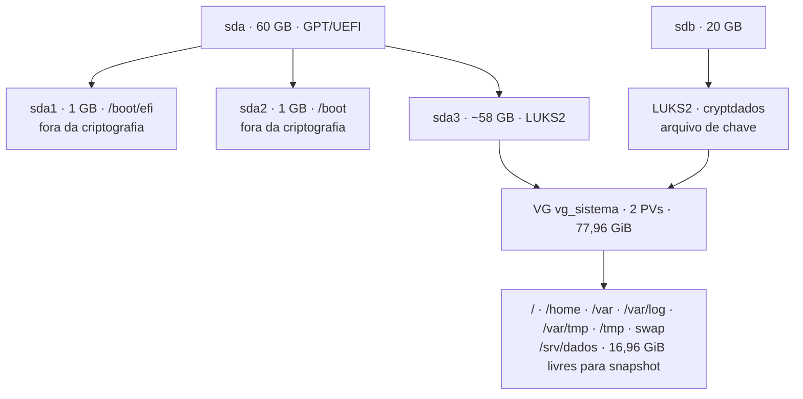

# Grupo 1 · Red Hat Enterprise Linux

**CP02 — Ambiente Linux** · Sistemas Operacionais Linux · Cibersegurança · FIAP · 2026
Turma **1TDCPF** · Professor: `<nome do professor>`

Instalação segura do **RHEL 10.2** em máquina virtual: particionamento com **LVM sobre LUKS2**, opções de montagem restritivas, segundo disco cifrado, **SSH endurecido** com a política de criptografia do sistema testada até o pós-quântico, e o script **`ssh-audit-harden.sh`** para auditar e corrigir a configuração do OpenSSH. Tudo com **SELinux em Enforcing do início ao fim**.

## Integrantes

| Nome | RM | Papel |
|---|---|---|
| Matheus Silva | 572335 | Líder e implemetantador de códigos |
| Gabriel de Oliveira | 569695 | Pesquisador |
| Davi Almeida | 569447 | Pesquisador| 
| Melquem Lameque | 573428 | Editor de Slides |
| João Vitor | 568847 | Apresentador |
| Nicolas Quadrelli | 568869 | Apresentador |

---

## Por onde começar

| Se você quer… | Abra |
|---|---|
| Reproduzir a instalação passo a passo, com as saídas reais | [`INSTALL.md`](INSTALL.md) |
| Conferir a prova de cada afirmação | [`evidencias/`](evidencias/) — tabela completa em [INSTALL.md § 12](INSTALL.md#12-evidências) |
| Ler ou executar o script | [`scripts/ssh-audit-harden.sh`](scripts/ssh-audit-harden.sh) — uso em [INSTALL.md § 11](INSTALL.md#11-script-de-auditoria) |
| Ver a apresentação | [`apresentacao/grupo1-rhel.pdf`](apresentacao/grupo1-rhel.pdf) |
| Ler a pesquisa | [`docs/pesquisa.pdf`](docs/pesquisa.pdf) |
| Saber como a IA foi usada | [`USO-DE-IA.md`](USO-DE-IA.md) |

## Entregáveis

| # | Entregável | Arquivo |
|---|---|---|
| 01 | Pesquisa (subscrição, ciclo de 10 anos, Red Hat Insights) | `docs/pesquisa.pdf` |
| 02 | Apresentação de 30 minutos e cinco perguntas | `apresentacao/grupo1-rhel.pptx` e `.pdf` |
| 03 | Guia de instalação reproduzível | `INSTALL.md` |
| 04 | Script em Shell | `scripts/ssh-audit-harden.sh` |
| — | Declaração de uso de IA | `USO-DE-IA.md` |

---

## O que foi construído

### Disco



- **LVM sobre LUKS**: um container por disco e o volume group inteiro dentro dele. Todo volume novo já nasce criptografado.
- LUKS2 · `aes-xts-plain64` · chave de 512 bits · **argon2id** · dois keyslots, com backup do cabeçalho feito depois do segundo e guardado **fora** da VM e do repositório.
- `nodev`, `nosuid` e `noexec` aplicados à mão, porque o instalador não põe nenhum. O teste mostrou onde o `noexec` para: bloqueia `./script.sh`, mas não bloqueia `bash script.sh`. E o conflito que a literatura prevê com o `dnf` não aconteceu: 147 pacotes atualizados sem erro.
- Segundo disco cifrado e agregado ao VG. `lv_dados` cresceu de 8 para 13 GiB **montado e em uso**; o snapshot de `/` ocupou 0,01%.
- KDUMP em automático: o RHEL 10 reaproveita a chave de volume (`link-volume-key` no `crypttab`), sem pedir senha e com a reserva padrão de 256 MB.

### SSH

- Acesso **só por chave ed25519**; senha e root desabilitados; `AllowGroups ssh-admins`. Um usuário **com chave válida** fora do grupo é barrado.
- Porta **6969**, com rótulo SELinux `ssh_port_t` e rich rule no firewalld com `limit value="10/m"`. Os serviços `ssh` e `cockpit` foram removidos do firewall.
- Banner legal e `LogLevel VERBOSE`.
- Drop-in **`01-hardening-grupo1.conf`**. O prefixo importa: no OpenSSH vale o **primeiro** valor lido, e o `50-redhat.conf` da própria distribuição define `X11Forwarding yes`. Um drop-in `99-` perdia para ele, e foi o nosso script que detectou isso.
- Política de criptografia **DEFAULT**: `NO-SHA1` não existe no RHEL 10.2, e `FUTURE` oferece só ML-KEM, o que quebrou o cliente do Windows. A DEFAULT **já oferece** troca de chaves pós-quântica (`mlkem768x25519-sha256`) a quem suporta. A autenticação continua clássica.

### Script `ssh-audit-harden.sh` (v1.1.0)

```bash
S=/usr/local/sbin/ssh-audit-harden.sh
sudo $S --audit                 # só lê sshd -T e compara com a baseline
sudo $S --apply --porta 6969    # backup → drop-in 01- → sshd -t → reload → confere
sudo $S --rollback              # restaura o último backup e revalida
```

- Lê a configuração **efetiva** (`sshd -T`), não o arquivo, e aponta o arquivo e a linha de onde vem cada valor divergente.
- Idempotente, sem derrubar sessões abertas. Códigos de saída: `0` ok · `1` achado · `2` uso · `3` dependência.
- Passa no `shellcheck` sem avisos. Validado na VM em 23/09: porta preservada sem `--porta`, verificação pós-aplicação conforme e segunda execução sem mudanças (evidência `31`).

---

## Estrutura

```
grupo1-rhel/
├── README.md
├── INSTALL.md              # guia reproduzível, com as saídas reais do laboratório
├── USO-DE-IA.md
├── LAYOUT-CONSOLE.md       # alternativa: o mesmo layout pelo terminal do instalador
├── scripts/
│   └── ssh-audit-harden.sh
├── evidencias/             # 01 a 32, saídas de comando capturadas na VM
├── prints/                 # recortes de tela usados na apresentação
├── apresentacao/
│   ├── grupo1-rhel.pptx
│   ├── grupo1-rhel.pdf   
└── docs/
    ├── pesquisa.pdf        # entregável 01 (ABNT)
    ├── pesquisa.md         # fonte do PDF
    ├── gerar-pdf.sh        # pandoc + XeLaTeX: refaz o PDF a partir do .md
    ├── modelo/             # capa, preâmbulo ABNT e filtro do pandoc
    ├── img/                # figuras da pesquisa
    └── GUIA-GRUPO1-RHEL.md # plano de execução (as diferenças para o executado estão no topo)
```

## Ambiente do laboratório

| Item | Valor |
|---|---|
| Sistema | RHEL 10.2 (Coughlan), kernel `6.12.0-211.56.1.el10_2` |
| Hipervisor | VirtualBox em Windows 11 · UEFI · 2 vCPU · 2 GB de RAM (host de 8 GB) |
| Rede | NAT (registro e atualização) + Host-Only (SSH, `192.168.56.103`) |
| Subscrição | Red Hat Developer Subscription for Individuals · sistema registrado |
| SELinux | Enforcing, política `targeted` |

## O que **não** está neste repositório

Passphrases do LUKS, senha de root, chaves privadas SSH e os backups do cabeçalho do LUKS. O backup do cabeçalho, junto com uma passphrase, abre o disco; por isso fica guardado fora da VM e fora do Git.

## Limites conhecidos

- `/boot` e `/boot/efi` ficam fora do LUKS, porque o GRUB precisa lê-los antes de existir qualquer chave. Mitigação possível: Secure Boot.
- Uma passphrase digitada no console a cada boot não escala para um datacenter. A alternativa seria desbloqueio por rede (Clevis + Tang) ou TPM2.
- O kdump está operacional, mas nenhum crash foi provocado para testá-lo.
- A troca de chaves do SSH é pós-quântica para clientes que suportam ML-KEM; a assinatura (ed25519) ainda é clássica.
