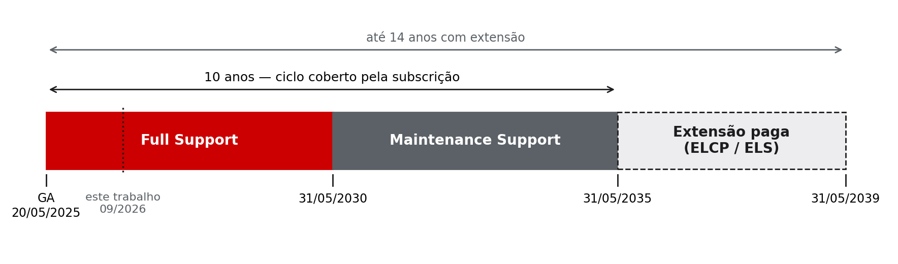
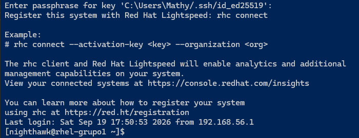
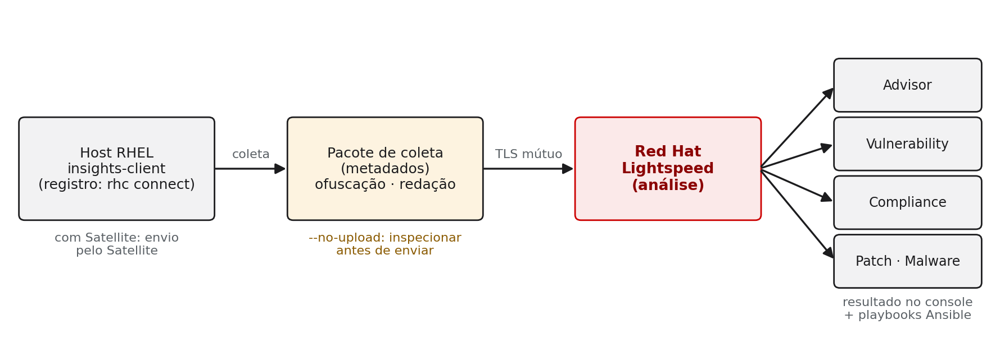
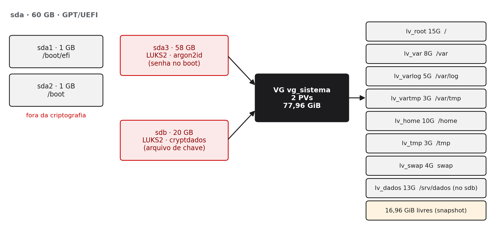
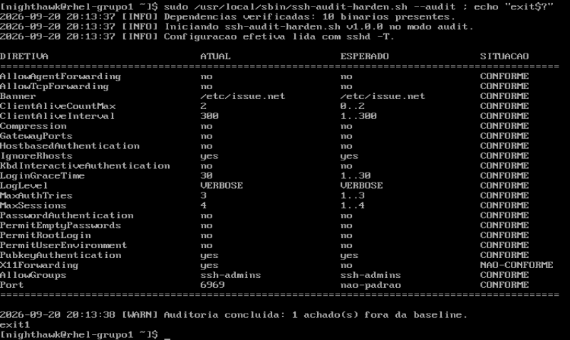
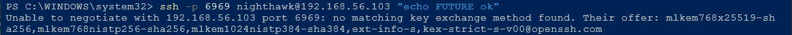

# Resumo {.unnumbered}

O Red Hat Enterprise Linux (RHEL) é distribuído sob licenças livres, mas é vendido por subscrição, o que levanta uma pergunta central para quem decide infraestrutura: o que uma organização compra quando compra RHEL? Este trabalho analisa três dimensões da resposta: o modelo de subscrição, o ciclo de vida de dez anos (e as extensões que o levam a quatorze) e o serviço de análise de risco em frota antes chamado Red Hat Insights e, desde novembro de 2025, Red Hat Lightspeed. O método combinou revisão da documentação primária da Red Hat e de normas técnicas com a implementação do RHEL 10.2 em laboratório virtualizado: particionamento com LVM sobre LUKS2, opções de montagem restritivas, segundo disco cifrado, SSH endurecido e um script próprio de auditoria. Os resultados mostram que a subscrição funciona como contrato de serviço continuado: sem ela, o sistema instalado não recebe nenhuma correção. O laboratório, por sua vez, contradisse a literatura em três pontos, todos documentados no repositório: o `noexec` em `/var/tmp` não quebrou o gerenciador de pacotes; um drop-in de hardening foi silenciosamente anulado pela regra de precedência do OpenSSH; e o endurecimento criptográfico recomendado em guias não existe no RHEL 10.2, cuja política padrão já oferece troca de chaves pós-quântica. Conclui-se que segurança, nesse contexto, é resultado de configuração verificada, não de instalação.

**Palavras-chave:** Red Hat Enterprise Linux; subscrição; ciclo de vida; Red Hat Lightspeed; criptografia pós-quântica.

# Introdução

O RHEL está presente em setores nos quais indisponibilidade e falha de segurança custam caro: bancos, operadoras de telecomunicações, governo e grandes varejistas. A própria Red Hat afirma ser parceira de "mais de 90% das empresas da Fortune 500", com base em dados de clientes e na lista da Fortune de setembro de 2025 [1]. O número é declaração do fornecedor, não medição independente de participação de mercado, e é tratado aqui como tal. Ainda assim, indica que a escolha de distribuição em ambiente corporativo raramente é uma questão de preferência técnica: é uma decisão de risco e de contrato.

Essa decisão esbarra num aparente paradoxo. O código-fonte do RHEL é livre, e durante anos existiram reconstruções gratuitas e compatíveis. A pergunta que este trabalho responde é, portanto: **o que exatamente uma organização compra quando compra RHEL, se o código é aberto?**

O trabalho delimita a resposta a três temas: o modelo de subscrição (Seção 2), o ciclo de vida de dez anos e suas extensões (Seção 3) e o serviço de gestão proativa de risco, Red Hat Lightspeed, antigo Insights (Seção 4). A Seção 5 mostra como o modelo de subscrição moldou o ecossistema de distribuições compatíveis. A Seção 6 analisa a implementação feita pelo grupo em laboratório. O passo a passo reproduzível está no `INSTALL.md` do repositório, e as saídas de comando que sustentam cada afirmação estão em `evidencias/`, citadas pelo nome do arquivo. A Seção 7 conclui.

# Modelo de subscrição

A tese desta seção é que a subscrição do RHEL não é licença de uso do software. É um contrato de serviço continuado.

## O que se compra

**Errata testada e assinada.** O centro do serviço é o fluxo de correções publicado como *errata*. A Red Hat classifica-as em três tipos: RHSA, que "contêm uma ou mais correções de segurança"; RHBA, com correções de bug e sem correções de segurança; e RHEA, com melhorias e funcionalidades novas [2]. Ter o código-fonte de um pacote é diferente de receber a correção já integrada, testada contra o conjunto exato de bibliotecas daquela versão do sistema e assinada por quem a testou. É essa segunda coisa que a subscrição entrega.

**Suporte com acordo de nível de serviço.** A Red Hat publica os níveis de atendimento de produção [3]. No nível *Standard*, a cobertura é em horário comercial, com primeira resposta em 1 hora útil para severidade 1 e em 4 horas úteis para severidade 2. No *Premium*, a cobertura é 24x7 para severidades 1 e 2, com resposta em 1 e 2 horas, respectivamente. O nível *Self-support* não inclui atendimento técnico.

**Certificação.** Fabricantes de servidores e de software corporativo (ERP, bancos de dados, plataformas de virtualização) certificam seus produtos contra versões específicas do RHEL. Para o cliente, isso significa que um problema num ambiente certificado tem um responsável contratual, e não uma discussão entre fornecedores sobre de quem é a culpa.

**Serviços incluídos.** A subscrição dá acesso, sem item adicional a comprar, ao Red Hat Lightspeed, cuja FAQ oficial diz: "não há item separado a comprar" [4]. Inclui também o *image builder*, suportado com a subscrição desde 2022 [5], e as ferramentas de conversão (Convert2RHEL) e de atualização *in-place* entre versões (Leapp) [6]. O Red Hat Satellite, gestor on-premises de conteúdo e de frota, aparece na documentação comercial como oferta adicional que a subscrição "suporta", e não como item incluído [7].

A Tabela 1 resume a diferença entre ter o software e ter a subscrição.

Table: Tabela 1 — Software livre × subscrição: o que muda

| Recurso | Sem subscrição | Com subscrição |
|---|---|---|
| Código-fonte dos pacotes | Sim (licenças livres; público via CentOS Stream desde 2023) | Sim |
| Instalar e executar o sistema | Sim | Sim |
| Repositórios oficiais e errata (RHSA/RHBA/RHEA) | **Não** | Sim, com assinatura GPG da Red Hat |
| Suporte técnico com SLA | Não | Conforme o nível (Standard ou Premium) |
| Certificação de hardware e software | Não se aplica | Sim |
| Red Hat Lightspeed (antigo Insights) | Não | Incluído |
| Ciclo de vida previsível de 10 anos | Não | Sim; até 14 com extensão paga |

Fonte: elaborado pelo grupo a partir de [2], [3], [4], [7] e [8].

## Tipos de subscrição

Além dos níveis de suporte, as subscrições variam pelo tipo de implantação (servidor físico, datacenter virtual, nuvem pública pelos *marketplaces*) e por variantes de propósito específico, como o RHEL for SAP Solutions. Para este trabalho, a relevante é a **Red Hat Developer Subscription for Individuals**, que foi a usada no laboratório. Segundo a Red Hat, ela é uma oferta "sem custo" do programa de desenvolvedores, permite instalar o software "em 16 nós físicos ou virtuais" e pode ser usada em "demonstrações, prototipagem, QA, pequenos usos em produção e acesso a nuvem". É, porém, **autossuportada**: não inclui suporte a questões do sistema operacional [9]. Dá acesso aos repositórios e à errata, mas não ao serviço humano.

## A subscrição na prática

No laboratório, o sistema foi registrado com `subscription-manager register`. O estado ficou registrado como `Overall Status: Registered` (evidência: `06-subscricao.txt`). Logo após o registro, o primeiro `dnf -y update` trouxe **147 pacotes**, entre eles `kernel`, `glibc`, `selinux-policy`, `crypto-policies` e `firewalld`, e importou as **três chaves GPG** da Red Hat a partir de `/etc/pki/rpm-gpg/` (registrado no `INSTALL.md`, seção 6). Desse ponto em diante, cada pacote instalado tem a assinatura conferida contra essas chaves. É o mecanismo concreto por trás da expressão "errata testada": não basta a correção existir, ela chega assinada por quem a testou.

## O sistema não registrado

O argumento mais forte da seção veio do próprio laboratório. Antes do registro, o sistema já estava instalado, com disco cifrado, SELinux em modo *Enforcing* e rede funcionando. Mesmo assim, o `dnf` respondia que o sistema não estava registrado e que não havia repositórios habilitados. A máquina estava operacional e **incapaz de receber uma única correção de segurança**: congelada no estado da ISO. O risco de um RHEL sem subscrição, portanto, não é jurídico. É operacional. Cada CVE publicada depois da data da mídia de instalação permanece aberta.

Essa observação foi feita durante a instalação e está documentada no `INSTALL.md` (seção de solução de problemas). Não há arquivo de evidência dedicado a ela, porque o registro foi feito antes da coleta sistemática.

# Ciclo de vida de dez anos

A tese desta seção é que previsibilidade de dez anos é requisito de arquitetura, não detalhe comercial. Um banco que homologa um sistema central não quer trocar a versão de uma biblioteca a cada seis meses. Quer saber, no dia da homologação, até quando aquela plataforma receberá correções.

## As fases

A política de ciclo de vida da Red Hat [8] divide as versões principais do RHEL 8, 9 e 10 em fases. Na **Full Support Phase**, a errata que atende aos critérios-padrão é publicada à medida que fica disponível. Na **Maintenance Support Phase**, "funcionalidade nova e habilitação de hardware novo não estão planejadas". Na **Extended Life Phase**, a subscrição mantém o acesso ao conteúdo já publicado, à documentação e à base de conhecimento, sem o fluxo regular de correções.

Um detalhe recente mostra por que a data de consulta importa: desde 1º de abril de 2025, o critério-padrão de errata de segurança passou a cobrir CVEs críticas e importantes e as moderadas com pontuação CVSS igual ou superior a 7 [8]. Uma vulnerabilidade moderada abaixo desse limiar pode não receber errata, mesmo dentro do ciclo.

As datas do RHEL 10, conforme a base de ciclo de vida da Red Hat consultada em 23/09/2026 [10], estão na Figura 1. O lançamento foi em 20/05/2025 [11]; o suporte completo vai até 31/05/2030 e o de manutenção até 31/05/2035. Com extensão paga, a cobertura chega a 31/05/2039.

{width=85%}

Fonte: elaborado pelo grupo com dados de [10], consultados em 23/09/2026.

## Extensões além dos dez anos

Este é o ponto que mais mudou recentemente. Até 2026, a Red Hat vendia extensões separadas: EUS (*Extended Update Support*) e Enhanced EUS, para permanecer numa versão menor; E4S, para soluções SAP; e ELS (*Extended Life-cycle Support*), para além dos dez anos. Em 2 de abril de 2026, a empresa anunciou o **Extended Life Cycle Premium (ELCP)**, "uma nova subscrição que oferece um ciclo de vida previsível de 14 anos para as versões principais do RHEL" [12].

Na data da consulta, a página de política descrevia o ELCP da seguinte forma [8]:

- substitui e unifica as ofertas EUS, Enhanced EUS e E4S;
- substitui o ELS a partir do RHEL 8.10, em 01/06/2029;
- oferece 6 anos de suporte, contados do lançamento, para versões menores pares elegíveis (.2, .4, .6, .8) e 9 anos para a versão menor terminal (.10);
- com complementos *Long-Life*, a cobertura de errata pode chegar a 14 anos.

Para este trabalho, a consequência é direta: o RHEL 10.2 instalado no laboratório é uma versão menor par, portanto elegível à extensão de seis anos. Como nomes e siglas mudaram poucos meses antes da escrita deste texto, o estado descrito aqui é o de 23/09/2026.

## Backport: por que a versão do pacote não muda

O conceito que separa quem entende o RHEL de quem apenas decora comandos é o *backport*. Em vez de atualizar um componente para a versão mais nova do projeto original quando surge uma falha, a Red Hat aplica a correção na versão já distribuída. Nas palavras da empresa, os pacotes atualizados trazem "uma versão *upstream* mais antiga com as correções aplicadas por backport" [13].

A consequência prática é importante para quem faz gestão de vulnerabilidades. Segundo a própria Red Hat, "algumas ferramentas de varredura e auditoria de segurança decidem sobre vulnerabilidades baseadas apenas no número de versão dos componentes que encontram. Isso resulta em falsos positivos, pois as ferramentas não levam em conta as correções aplicadas por backport" [13]. A fonte de verdade é o mapeamento entre CVE e errata publicado pela Red Hat, e o histórico do pacote (`rpm -q --changelog`). Esse é também o motivo pelo qual o serviço de vulnerabilidades do Lightspeed (Seção 4) trabalha com esse mapeamento, e não com números de versão.

## Comparação de ciclos

O modelo de dez anos não é exclusivo do RHEL. As reconstruções compatíveis o reproduzem, e a comunidade que o antecede tem ciclos muito mais curtos. A Tabela 2 compara as seis distribuições tratadas pelos grupos da disciplina.

Table: Tabela 2 — Ciclos de vida comparados

| Distribuição | Mantenedor | Ciclo por versão principal | Modelo | Quando escolher |
|---|---|---|---|---|
| RHEL | Red Hat | 10 anos (até 14 com ELCP) | Estável, com backport e suporte contratual | Carga crítica com exigência de suporte e certificação |
| Fedora | Comunidade Fedora (patrocínio Red Hat) | ~13 meses | Inovação rápida | Estação de desenvolvimento; testar o futuro do RHEL |
| CentOS Stream | Projeto CentOS | Até o fim do *Full Support* do RHEL correspondente (Stream 9: 31/05/2027) | Prévia contínua do próximo RHEL | Contribuir e testar antes do RHEL |
| Rocky Linux | RESF | 10 anos (Rocky 10 até 31/05/2035) | Reconstrução compatível | Compatibilidade sem custo de licença |
| AlmaLinux | AlmaLinux OS Foundation | 10 anos (5 ativos e 5 de segurança) | Compatível em ABI | Compatibilidade sem custo, com mais liberdade de correção |
| Oracle Linux | Oracle | 10 anos + suporte estendido e *Sustaining* | Compatível, com kernel próprio opcional (UEK) | Ambientes Oracle |

Fonte: elaborado pelo grupo a partir de [8], [14], [15], [16], [17] e [18]. O ciclo do Fedora foi confirmado apenas em página de rascunho do projeto, porque a página oficial estava inacessível no momento da consulta.

# Red Hat Lightspeed (antigo Insights)

A tese desta seção é que gestão de risco em frota não escala por inspeção manual, e que automatizá-la tem um preço: o dado que sai da máquina.

## O que é, e a mudança de nome

Trata-se de um serviço em nuvem de análise de risco, incluído na subscrição do RHEL e operado a partir do console da Red Hat. Em 4 de novembro de 2025, a empresa anunciou: "o Red Hat Insights agora é Red Hat Lightspeed", com transição gradual até 2026 [19]. A FAQ oficial esclarece que o novo nome **não** se confunde com outros produtos de mesmo sobrenome: o Red Hat Lightspeed "é diferente do RHEL Lightspeed, do OpenShift Lightspeed e do Ansible Lightspeed" [4]. Em especial, o RHEL Lightspeed é o assistente de IA anunciado com o RHEL 10 [11].

A mudança de nome não ficou só na documentação: apareceu no sistema do laboratório. A mensagem exibida no login por SSH no RHEL 10.2 dizia *"Register this system with Red Hat Lightspeed: rhc connect"*, como mostra a Figura 2. Um tutorial escrito antes de novembro de 2025 descreveria uma tela diferente.

{width=62%}

Fonte: print do grupo, 19/09/2026.

## Arquitetura

O fluxo tem quatro elos, representados na Figura 3. O `insights-client`, instalado no host, coleta dados do sistema e os envia ao console da Red Hat; o serviço analisa esses dados e devolve recomendações [20]. O registro atual é feito pelo cliente `rhc` (`rhc connect`), que conecta o host ao Subscription Manager e ao Lightspeed e ativa o *daemon* de configuração remota [20]. Se o host já está ligado a um Red Hat Satellite, o cliente usa essa conexão para falar com a Red Hat [21]. Toda comunicação usa "canais criptografados, com TLS e autenticação mútua por certificado", e as regras de coleta são assinadas: se a assinatura não confere, a coleta para [21].

{width=85%}

Fonte: elaborado pelo grupo a partir de [20] e [21].

## Os serviços

A Tabela 3 resume os serviços listados na documentação atual [22] e o que cada um resolve.

Table: Tabela 3 — Serviços do Red Hat Lightspeed

| Serviço | O que resolve |
|---|---|
| Advisor | Riscos de configuração conhecidos, que afetam disponibilidade, desempenho, estabilidade ou segurança |
| Vulnerability | CVEs aplicáveis a cada host, com base no mapeamento CVE–errata (e não na versão do pacote) |
| Compliance | Aderência a políticas SCAP (*SCAP Security Guide*), a mesma base do OpenSCAP |
| Patch | Errata aplicável e pendente em cada host |
| Malware detection | Varredura com YARA, com assinaturas da equipe IBM X-Force e, opcionalmente, da CrowdStrike |
| Remediations | Geração de *playbooks* Ansible para corrigir o que foi encontrado |

Fonte: elaborado pelo grupo a partir de [22], [23] e [24].

O serviço de detecção de *malware*, por exemplo, "examina sistemas RHEL em busca de malware usando o YARA com assinaturas da IBM X-Force e da CrowdStrike", esta última condicionada a uma licença própria [23]. O de conformidade avalia os hosts contra políticas do *SCAP Security Guide* [24]; é o elo com verificadores de *baseline* como o CIS Benchmark.

## O que sai da máquina

Esta é a questão que um trabalho de cibersegurança não pode pular. Apresentar o Lightspeed apenas como "ferramenta útil da Red Hat" perde o ponto: ele funciona **enviando informação do servidor para fora da organização**.

A Red Hat afirma que o cliente coleta "o mínimo necessário de metadados" e que a coleta "não tem como alvo dados pessoais" [21]. Metadado de configuração, porém, não é inócuo. Nomes de host, endereços IP, trechos de arquivos de configuração e a lista de pacotes descrevem a superfície de ataque de uma organização com bastante precisão. Por isso o cliente oferece controles [25]:

- **Inspeção sem envio.** A opção `--no-upload` gera o pacote de coleta localmente, sem enviar; `--output-dir` grava os dados sem compressão para leitura.
- **Ofuscação.** O arquivo `/etc/insights-client/insights-client.conf` permite ofuscar endereços IPv4 e nomes de host. As chaves antigas `obfuscate` e `obfuscate_hostname` foram substituídas por `obfuscation_list` em versões recentes do cliente.
- **Redação.** O `file-redaction.yaml` exclui comandos e arquivos inteiros da coleta; o `file-content-redaction.yaml` redige conteúdo por padrão ou por palavra-chave. Os dois substituem o antigo `remove.conf`.
- **Código auditável.** O cliente é aberto (`insights-client` e `insights-core`, este sob licença Apache-2.0), e a coleta pode ser lida antes de ser confiada [26].

**Análise do grupo: o caso de uma instituição financeira brasileira.** Dois marcos legais se aplicam. A Lei Geral de Proteção de Dados (Lei nº 13.709/2018) exige que os agentes de tratamento adotem "medidas de segurança, técnicas e administrativas aptas a proteger os dados pessoais de acessos não autorizados" (art. 46) [27]. Se a coleta não tem como alvo dados pessoais, o ponto de atenção é o que pode vazar por acidente: um nome de usuário num arquivo de configuração, um *hostname* que identifica uma pessoa. A redação e a ofuscação são justamente as ferramentas para isso.

O segundo marco é mais específico. A Resolução CMN nº 4.893/2021 disciplina a contratação de serviços de processamento, armazenamento de dados e computação em nuvem por instituições financeiras [28]:

- exige procedimentos de avaliação **prévios** à contratação (art. 12);
- exige que a contratação de serviços **relevantes** seja comunicada ao Banco Central (art. 15), no prazo de até dez dias após a contratação;
- para serviços prestados no exterior, condiciona a contratação, entre outros requisitos, à existência de convênio de troca de informações entre o Banco Central e os supervisores do país onde o serviço é prestado (art. 16).

A resolução foi alterada em 2024 e 2025. Uma análise para uso real deve conferir a redação vigente.

Com isso, o grupo entende que uma instituição financeira aceitaria o envio nas seguintes condições:

1. classificar o serviço (é "relevante"?) e cumprir o rito da resolução;
2. ativar ofuscação e redação por padrão, validadas por inspeção do pacote com `--no-upload` antes do primeiro envio;
3. restringir o escopo a servidores cuja configuração, se exposta, não revele dados de clientes.

Onde isso não for aceitável, a alternativa é o Satellite on-premises. Ela mantém o conteúdo dentro da organização, mas custa uma subscrição adicional e uma infraestrutura própria para operar.

**Decisão do laboratório.** O host do laboratório **não** foi conectado ao Lightspeed: o `rhc connect` sugerido na mensagem de login não foi executado. Assim, nenhum dado do laboratório foi enviado ao serviço, e a análise desta seção é documental. Um próximo passo natural seria gerar o pacote com `--no-upload`, inspecioná-lo e decidir, com base no conteúdo real, o que redigir antes de conectar.

# O RHEL e as reconstruções

O modelo de subscrição tem consequências para todo o ecossistema, e a existência dos outros cinco grupos da disciplina é, em parte, efeito dele.

Durante quase duas décadas, o CentOS foi uma reconstrução gratuita do RHEL a partir do código-fonte publicado. Em dezembro de 2020, o projeto anunciou o fim do CentOS Linux para concentrar-se no CentOS Stream. O Stream deixou de ser uma cópia do RHEL e passou a ser sua prévia contínua: o código entra no Stream **antes** de chegar ao RHEL. Em resposta, surgiram o Rocky Linux, pela Rocky Enterprise Software Foundation (RESF), e o AlmaLinux.

Em 21 de junho de 2023, a Red Hat anunciou que "o CentOS Stream será agora o único repositório para lançamentos públicos de código-fonte relacionados ao RHEL" [29]. Cinco dias depois, a empresa justificou a decisão: continuaria enviando código aos projetos de origem e cumprindo licenças como a GPL, mas afirmou que "simplesmente reempacotar o código [...] e revendê-lo como está, sem valor agregado, torna a produção desse software aberto insustentável", e que não estava "sob nenhuma obrigação de facilitar as coisas para quem reconstrói" [30].

As respostas foram diferentes, e são o que interessa tecnicamente:

- **Rocky Linux (RESF).** Manteve a meta de compatibilidade integral, obtendo o código-fonte por vias que a GPL garante. Entre elas estão as imagens de contêiner UBI e instâncias do RHEL em nuvem pública, com o argumento de que "ninguém pode impedir a redistribuição de software GPL" [31].
- **AlmaLinux.** Mudou de meta em julho de 2023: passou de compatibilidade "bug a bug" para **compatibilidade de ABI**, entendida como garantir que "aplicações feitas para rodar no RHEL possam rodar sem problemas no AlmaLinux" [32]. Na prática, isso lhe dá liberdade para corrigir falhas antes do RHEL, ao custo de não ser mais uma cópia idêntica.
- **Oracle.** Declarou que, enquanto distribuir Linux, publicará binários e código-fonte livremente [33]. Em agosto de 2023, fundou com a CIQ e a SUSE a **OpenELA**, associação para "fornecer código-fonte Enterprise Linux aberto e livre" compatível com o RHEL [34].

O tom deste trabalho é analítico. A Red Hat argumenta sustentabilidade e o fato de que o valor está no serviço, não no código. As reconstruções argumentam o espírito do software livre e a letra da GPL. Para uma organização, a consequência prática é que a "compatibilidade com RHEL" deixou de ser um conceito único: é preciso perguntar **qual** compatibilidade (binária, de ABI, bug a bug) e **com qual** fonte de código.

# Aplicação prática no laboratório

Esta seção mostra que a teoria das seções anteriores foi exercida num sistema real, e que o sistema real contradisse a teoria em mais de um ponto. Toda afirmação aponta para um arquivo em `evidencias/` do repositório.

## Ambiente

O sistema instalado foi o RHEL **10.2 (Coughlan)**, com kernel `6.12.0-211.56.1.el10_2` após a atualização (evidência: `05-sistema.txt`), em instalação mínima, sem interface gráfica. A máquina virtual rodou no VirtualBox sobre Windows 11, com UEFI, 2 vCPU e 2 GB de RAM, limite imposto por um *host* de 8 GB. O SELinux ficou em modo *Enforcing*, política `targeted`, do início ao fim do trabalho (evidência: `05-sistema.txt`). A VM teve duas placas de rede: NAT, para registro e atualização, e Host-Only, para o acesso SSH a partir do notebook. Antes da instalação, o SHA-256 da ISO foi conferido contra o valor publicado pela Red Hat (print `00-sha256-iso.png`).

## Disco: LVM sobre LUKS em dois discos

O esquema escolhido foi **LVM sobre LUKS**: a criptografia fica na partição física e o *volume group* inteiro vive dentro dela, com um único container por disco. A alternativa oposta, LUKS sobre LVM, criaria um container por volume lógico, várias senhas no boot e metadados do VG expostos, e não se converte uma na outra sem reinstalar. No instalador (Anaconda), a diferença está num único *checkbox*: *Criptografar* marcado no diálogo do **grupo de volume**, e não no de cada volume. A Figura 4 mostra o estado final, e a Tabela 4 resume as decisões.

{width=72%}

Fonte: elaborado pelo grupo (evidências: `01-luks-sda3.txt`, `03-montagens.txt`, `20-segundo-disco.txt`).

Table: Tabela 4 — Decisões de disco e o que cada uma bloqueia

| Decisão | Justificativa | Risco residual |
|---|---|---|
| LVM sobre LUKS | Uma senha no boot; todo volume novo nasce cifrado; metadados do VG protegidos | Cabeçalho LUKS corrompido compromete o VG → backup do cabeçalho e segundo *keyslot* |
| `/boot` e `/boot/efi` fora do LUKS | O GRUB precisa ler kernel e initramfs antes de existir qualquer chave | Kernel e initramfs em claro; mitigável com Secure Boot |
| `/tmp` e `/var/tmp` com `nodev,nosuid,noexec` | Bloqueia execução direta de *payload* em diretório gravável por todos | Não bloqueia `bash script.sh` (testado) |
| `/var/log` com `nodev,nosuid,noexec` | Integridade da trilha de auditoria | — |
| `/home` com `nodev,nosuid` | Impede binário SUID criado por usuário comum | Sem `noexec`, por necessidade de uso |
| Espaço livre no VG | Snapshot e crescimento de volume a quente | Disco aparentemente subutilizado |
| Segundo disco também em LUKS | `pvcreate` direto deixaria parte do VG em claro | Arquivo de chave em `/etc`, dentro do LUKS principal |

Fonte: `INSTALL.md`, seção 3.

O container principal usa LUKS2, com cifra `aes-xts-plain64`, chave de 512 bits (o modo XTS combina duas chaves de 256), derivação de chave **argon2id** e dois *keyslots*, um deles com senha de reserva (evidência: `01-luks-sda3.txt`). O argon2id é o padrão do `cryptsetup` para LUKS2 desde a versão 2.4.0 [35]. É uma função propositalmente cara em memória: cada tentativa de adivinhar a senha custa dezenas a centenas de megabytes de RAM, o que encarece ataques de força bruta em paralelo. O backup do cabeçalho foi refeito depois do segundo *keyslot* e guardado **fora** da VM e do repositório, porque o cabeçalho, somado a uma senha, abre o disco.

Um detalhe mereceu decisão consciente: o Anaconda ativou `allow-discards` no container (evidência: `01-luks-sda3.txt`). O repasse de TRIM melhora o desempenho em armazenamento virtual e SSD, mas revela no disco cifrado quais blocos estão em uso. É um vazamento de metadado aceitável num laboratório, e registrado.

O **segundo disco**, de 20 GB, também foi cifrado em LUKS2, com desbloqueio automático no boot por arquivo de chave referenciado em `/etc/crypttab` (evidências: `02-luks-sdb.txt`, `20-segundo-disco.txt`). O arquivo fica dentro do disco principal, que já é cifrado. O disco foi agregado ao VG, que passou de 57,98 para 77,96 GiB. Um volume `lv_dados` foi criado inteiro nele (`lvs -o devices` mostra `cryptdados(0)`) e crescido de 8 para 13 GiB **com o sistema de arquivos montado e em uso**. O snapshot de `/`, criado para o teste e depois removido, ocupou 0,01% do espaço reservado, porque só guarda o que muda (valores registrados no `INSTALL.md`, seções 8.4 e 8.5). O espaço livre que parecia desperdício no desenho foi o que permitiu esse ciclo de vida.

O **KDUMP** trouxe o último caso. O instalador avisou: *"Kdump may require extra setup for encrypted devices"* (o kdump pode exigir configuração extra em dispositivos cifrados). O motivo é real. Depois de um travamento, um segundo kernel sobe apenas para gravar a memória em `/var/crash`, que está dentro do LUKS: não há ninguém para digitar a senha, e o argon2id exigiria reservar muito mais memória. Os autores da solução estimam cerca de 1.300 MB, contra os 256 MB padrão [36]. O grupo manteve o KDUMP em automático e verificou o resultado. O `crypttab` do disco principal saiu com a opção `link-volume-key=…kdump-cryptsetup…`: no boot, o systemd guarda a chave de volume no *keyring* do kernel e o kdump a reaproveita [36]. O `kdumpctl` confirmou o serviço "operacional", com a reserva **padrão** de 256 MB (evidências: `20-segundo-disco.txt`, `32-kdump.txt`). O limite também está registrado, pelo próprio sistema: *"No vmcore creation test performed"*. Nenhum travamento foi provocado para testar.

## Onde a prática contradisse a literatura

Os três casos a seguir são o resultado mais importante do laboratório. Cada um tem hipótese, teste e decisão.

**a) O `noexec` em `/var/tmp` quebraria o gerenciador de pacotes.**

- *Hipótese:* guias de hardening avisam que scripts de instalação de pacotes usam `/var/tmp` e falhariam com `noexec`.
- *Teste:* com `noexec` já ativo em `/tmp` e `/var/tmp`, o `dnf update` de 147 pacotes (com *scriptlets* de `glibc`, `selinux-policy`, `crypto-policies` e `firewalld`) e depois um `dnf reinstall bash`, capturado como evidência (`06c-dnf-com-noexec.txt`). O update está registrado no `INSTALL.md`, seções 6 e 7.
- *Resultado:* nenhuma falha.
- *Decisão:* manter o `noexec`, com o procedimento de remontagem temporária documentado como contingência.

O mesmo teste mostrou o limite real do controle. Executar `/tmp/teste.sh` diretamente retornou *Permissão negada*; executar `bash /tmp/teste.sh` funcionou (evidência: `06b-teste-noexec.txt`). O `noexec` impede executar o arquivo, não impede chamar o interpretador. É um controle real, com limite conhecido.

**b) O drop-in de hardening não valia inteiro.**

- *Hipótese:* um arquivo `99-hardening-grupo1.conf` em `/etc/ssh/sshd_config.d/`, com `X11Forwarding no`, desligaria o encaminhamento de X11.
- *Teste:* o script do grupo, que lê a configuração **efetiva** com `sshd -T`, acusou `X11Forwarding yes` como NÃO-CONFORME (Figura 5; evidência: `21-audit-antes.txt`).
- *Causa:* segundo o manual, "a menos que indicado o contrário, para cada palavra-chave, o primeiro valor obtido será usado", e os arquivos incluídos são processados "em ordem lexical" [37]. O `50-redhat.conf` da própria distribuição define `X11Forwarding yes` e é lido antes do `99-` (a ordem de leitura está em `22-dropin-precedencia.txt`; a linha `50-redhat.conf:10:X11Forwarding yes`, no print `06-grep-precedencia.png`).
- *Decisão:* renomear o arquivo para `01-`. A auditoria zerou (evidência: `23-audit-depois.txt`).

A lição resume o trabalho: **configuração escrita não é configuração efetiva**, e só uma ferramenta que lê a efetiva enxerga a diferença.

{width=58%}

Fonte: print do grupo, 20/09/2026; o mesmo achado está em `evidencias/21-audit-antes.txt`.

**c) O endurecimento criptográfico recomendado não existe no RHEL 10.2.**

- *Hipótese:* material de hardening recomenda `update-crypto-policies --set DEFAULT:NO-SHA1`.
- *Teste:* o comando falhou com `NO-SHA1.pmod not found`: o submódulo não existe nesta versão (saída registrada no `INSTALL.md`, seção 10.1; conclusão em `19-decisao-crypto.txt`).
- *Verificação:* a política DEFAULT já recusa SHA-1 em assinaturas, e o *journal* do `sshd` registra isso a cada conexão: *"SHA1 in signatures is disabled for RSA keys"* (evidência: `12-journal-ssh.txt`).
- *Decisão:* manter a DEFAULT. A política de criptografia vale para o sistema inteiro (SSH, TLS, Kerberos), não para um serviço.

## SSH endurecido

O OpenSSH sai da instalação permissivo para funcionar em qualquer ambiente. Os controles aplicados foram: autenticação exclusivamente por chave ed25519 [38], com senha e *keyboard-interactive* desligados e `PermitRootLogin no`; `AllowGroups ssh-admins`, `MaxAuthTries 3`, `LoginGraceTime 30`, banner legal e `LogLevel VERBOSE`; porta 6969, com rótulo SELinux `ssh_port_t` aplicado **antes** de alterar o serviço; e, no firewalld, somente uma *rich rule* com `limit value="10/m"`, com os serviços `ssh` e `cockpit` removidos (evidências: `07` a `11`).

A ordem importou. Com SELinux em *Enforcing*, o `sshd` não abre uma porta sem o rótulo, e a reação errada, comum, é desligar o SELinux.

As três provas de acesso estão no *journal* (evidência: `12-journal-ssh.txt`):

- a chave aceita, com a impressão digital SHA256 rastreável;
- a tentativa sem chave encerrada antes da autenticação; o cliente recebeu `Permission denied (publickey,…)` sem que a senha sequer fosse pedida (print `03-ssh-chave-e-senha.png`);
- o usuário `teste-negado`, **com chave válida instalada** (procedimento no `INSTALL.md`, Checkpoint 6), barrado: *"not allowed because none of user's groups are listed in AllowGroups"*.

A terceira prova é a mais relevante: credencial válida não basta, o acesso é por lista de permissão explícita. Um efeito colateral foi observado: o registro `srclimit_penalise` mostra o próprio OpenSSH penalizando o endereço que abre conexões sem autenticar, numa camada independente do limite do firewall.

## Criptografia pós-quântica: o que já está no servidor

Este é o ponto técnico mais sensível do trabalho, e por isso vai com cuidado.

**O que a política padrão oferece.** A DEFAULT do RHEL 10.2 **já oferece**, na troca de chaves do SSH, três métodos híbridos pós-quânticos: `mlkem768x25519-sha256`, `mlkem768nistp256-sha256` e `mlkem1024nistp384-sha384` (evidências: `17-kex-default.txt`, `18-kex-pos-quantico.txt`). O ML-KEM é o mecanismo de encapsulamento de chave padronizado pelo NIST na FIPS 203, de agosto de 2024 [39]. Os mesmos três nomes foram publicados pelo IETF no RFC 10042, em agosto de 2026 [40]. No OpenSSH, o método `mlkem768x25519-sha256` surgiu na versão 9.9, de setembro de 2024 [41], e tornou-se o padrão de troca de chaves na 10.0, de abril de 2025 [42].

**Por que "híbrido".** O segredo da sessão combina o ML-KEM com um algoritmo clássico (X25519 ou curva NIST). Se o pós-quântico tiver uma falha ainda desconhecida, o clássico segura. Se um computador quântico quebrar o clássico, o pós-quântico segura. O que isso protege é o **sigilo da sessão**, inclusive contra a estratégia "colher agora, decifrar depois": tráfego gravado hoje não fica legível quando a máquina quântica existir.

**O teste.** Com a política FUTURE, o servidor passou a oferecer **somente** os métodos ML-KEM, e o cliente OpenSSH do Windows falhou com *"no matching key exchange method found"* (Figura 6). Com DEFAULT, a negociação real caiu em `curve25519-sha256`, com chave de *host* `ssh-ed25519` e cifra `chacha20-poly1305` (evidência: `19-decisao-crypto.txt`).

{width=100%}

Fonte: print do grupo, 20/09/2026.

A Tabela 5 resume o teste.

Table: Tabela 5 — Políticas de criptografia testadas

| Política | Troca de chaves oferecida | Cliente Windows conecta? | Algoritmo negociado |
|---|---|---|---|
| DEFAULT | ML-KEM híbrido + clássicos (curve25519, ECDH, DH) | Sim | `curve25519-sha256` |
| FUTURE | Somente ML-KEM híbrido | **Não** | — |

Fonte: evidências `17-kex-default.txt`, `18-kex-pos-quantico.txt` e `19-decisao-crypto.txt`.

A conclusão sustenta a decisão do grupo. A FUTURE não **acrescenta** o pós-quântico, que já estava lá: ela **remove** o clássico. A DEFAULT entrega ML-KEM a quem suporta sem excluir quem não suporta, e a FUTURE só faria sentido num parque homogêneo de clientes atualizados.

**O limite, dito com precisão.** A **autenticação** continua clássica: a chave do servidor e a do usuário são `ssh-ed25519`. A assinatura pós-quântica padronizada, ML-DSA (FIPS 204) [43], só chegou ao OpenSSH na versão 10.4, de julho de 2026, e em caráter experimental. O esquema é composto (ML-DSA-44 com Ed25519), "não habilitado por padrão" [44], e não está disponível no RHEL 10.2. O sigilo está protegido; a identidade, ainda não.

## O script `ssh-audit-harden.sh`

O script do grupo tem três modos:

- **`--audit`**: lê a configuração efetiva com `sshd -T` e compara vinte diretivas, mais `AllowGroups` e `Port`, com a *baseline*;
- **`--apply`**: grava um drop-in próprio, com backup, validação por `sshd -t` e *reload* sem derrubar sessões abertas;
- **`--rollback`**: restaura o último backup e revalida.

Os códigos de saída distinguem sucesso (0), achado (1), erro de uso (2) e dependência ausente ou ambiente inválido (3). O script é idempotente: a segunda aplicação responde *"Nada a fazer"* (evidências: `24` a `30`, geradas com a versão 1.0.0, exceto `24` e `29`, refeitas com a 1.1.0).

Testar a ferramenta no servidor real gerou a versão 1.1.0:

- o achado de precedência (caso *b*) passou a vir acompanhado do arquivo e da linha que definem o valor divergente;
- a revisão do código revelou que a versão 1.0.0, chamada sem `--porta`, regravaria o drop-in sem a linha `Port` e mandaria o `sshd` de volta à porta 22, fechada no firewall; a 1.1.0 preserva a porta em uso;
- depois de aplicar, o script relê a configuração efetiva e acusa se outro arquivo ainda tem precedência.

A versão 1.1.0 passou no `shellcheck` sem avisos. Foi validada na VM em 23/09/2026 com auditoria limpa, aplicação sem `--porta` preservando a 6969, verificação pós-aplicação conforme e segunda execução sem mudanças (evidência: `31-v110-validacao.txt`).

A Tabela 6 posiciona o script em relação a ferramentas de mercado.

Table: Tabela 6 — O script em relação a ferramentas de mercado

| Ferramenta | Cobre | Não cobre |
|---|---|---|
| ssh-audit | Varredura remota de algoritmos e banners | A configuração efetiva lida localmente |
| OpenSCAP | O sistema inteiro, com perfis CIS e STIG | Correção reversível e granular |
| Ansible (roles de hardening) | Frota inteira, idempotente por natureza | Exige infraestrutura de automação |
| `ssh-audit-harden.sh` | Leitura local da configuração efetiva, correção reversível, autocontido | Um host por vez |

Fonte: elaborado pelo grupo.

# Conclusão

O que uma organização compra quando compra RHEL, se o código é aberto? Compra **tempo e responsabilidade**. Tempo, na forma de dez anos previsíveis, até quatorze com o ELCP, com correções trazidas por backport sem quebrar o que foi homologado. Responsabilidade, na forma de errata testada e assinada, suporte contratual, certificação e um serviço de análise de risco em frota incluído. O laboratório tornou o argumento concreto: um RHEL instalado e sem registro funciona, mas não recebe nenhuma correção.

O laboratório mostrou também que a parte decisiva do trabalho foi configuração, não instalação. O instalador não aplicou nenhuma opção de montagem restritiva, e o OpenSSH não veio endurecido. Em três pontos, testar contradisse o que a literatura previa: o `noexec` não quebrou o gerenciador de pacotes; um arquivo de hardening foi anulado em silêncio pela regra de precedência do OpenSSH; e o endurecimento criptográfico recomendado não existe, porque a política padrão já é mais forte e já oferece troca de chaves pós-quântica. Nos três casos, a diferença só apareceu porque houve verificação, e a verificação só foi possível porque havia evidência registrada.

As limitações são claras. O ambiente foi virtualizado, com um único host, sem Satellite e sem carga real. O host não foi conectado ao Lightspeed, e a análise da Seção 4 é documental. O kdump não foi exercitado com um travamento real. A autenticação SSH continua clássica. A detecção de sombreamento do script é heurística. Os próximos passos naturais seriam o desbloqueio de disco por rede com Clevis e Tang (NBDE), para eliminar a senha digitada no console; a instalação automatizada com Kickstart; a conformidade em frota com OpenSCAP; a inspeção do pacote de coleta do Lightspeed com `--no-upload` antes de qualquer conexão; e a assinatura pós-quântica no SSH, quando ela deixar de ser experimental e chegar ao RHEL.

# Referências {.unnumbered}

Todas as fontes eletrônicas foram acessadas em 23 set. 2026.

[1] RED HAT. *Why choose Red Hat Enterprise Linux?* Disponível em: <https://www.redhat.com/en/topics/linux/why-choose-red-hat-enterprise-linux>.

[2] RED HAT. *Explaining Red Hat Errata*. Disponível em: <https://access.redhat.com/articles/explaining_redhat_errata>.

[3] RED HAT. *Production Support Service Level Agreement*. Disponível em: <https://access.redhat.com/support/offerings/production/sla>.

[4] RED HAT. *Red Hat Lightspeed (formerly Red Hat Insights) — FAQ*. Disponível em: <https://access.redhat.com/support/insights/faq>.

[5] RED HAT. *Announcing full support for the new Red Hat Enterprise Linux image builder service*. 10 maio 2022. Disponível em: <https://www.redhat.com/en/blog/announcing-full-support-new-red-hat-enterprise-linux-image-builder-service>.

[6] RED HAT. *Upgrading from RHEL 9 to RHEL 10*. Documentação do RHEL 10. Disponível em: <https://docs.redhat.com/en/documentation/red_hat_enterprise_linux/10/html/upgrading_from_rhel_9_to_rhel_10/index>.

[7] RED HAT. *Red Hat Enterprise Linux subscription guide*. Disponível em: <https://www.redhat.com/en/resources/red-hat-enterprise-linux-subscription-guide>.

[8] RED HAT. *Red Hat Enterprise Linux Life Cycle*. Disponível em: <https://access.redhat.com/support/policy/updates/errata>.

[9] RED HAT DEVELOPER. *No-cost Red Hat Enterprise Linux Individual Developer Subscription: FAQs*. Disponível em: <https://developers.redhat.com/articles/faqs-no-cost-red-hat-enterprise-linux>.

[10] RED HAT. *Product Life Cycles — Red Hat Enterprise Linux*. Disponível em: <https://access.redhat.com/product-life-cycles/>.

[11] RED HAT. *Red Hat Introduces Red Hat Enterprise Linux 10 with Supercharged Intelligence and Security Across Hybrid Environments*. Boston, 20 maio 2025. Disponível em: <https://www.redhat.com/en/about/press-releases/red-hat-introduces-rhel-10>.

[12] RED HAT. *Red Hat Enhances Enterprise Stability with Red Hat Enterprise Linux Extended Life Cycle Premium*. Raleigh, 2 abr. 2026. Disponível em: <https://www.redhat.com/en/about/press-releases/red-hat-enhances-enterprise-stability-red-hat-enterprise-linux-extended-life-cycle-premium>.

[13] RED HAT. *Backporting Security Fixes*. Disponível em: <https://access.redhat.com/security/updates/backporting>.

[14] CENTOS PROJECT. *CentOS Stream 9*. Disponível em: <https://www.centos.org/stream9/>.

[15] ROCKY LINUX. *Rocky Linux Release Version Guide*. Disponível em: <https://wiki.rockylinux.org/rocky/version/>.

[16] ALMALINUX. *AlmaLinux Release Notes*. Disponível em: <https://wiki.almalinux.org/release-notes/>.

[17] ORACLE. *Oracle Linux Support*. Disponível em: <https://www.oracle.com/linux/support/>.

[18] FEDORA PROJECT. *Fedora Release Life Cycle*. Disponível em: <https://docs.fedoraproject.org/en-US/releases/lifecycle/>.

[19] MIDWOOD, Brent. *Red Hat Insights is now Red Hat Lightspeed*. Red Hat Blog, 4 nov. 2025. Disponível em: <https://www.redhat.com/en/blog/red-hat-insights-now-red-hat-lightspeed>.

[20] RED HAT. *Registering RHEL systems and configuring client tools with Red Hat Lightspeed*. Disponível em: <https://docs.redhat.com/en/documentation/red_hat_lightspeed/1-latest/html/registering_rhel_systems_and_configuring_client_tools_with_red_hat_lightspeed/connecting-and-registering-systems>.

[21] RED HAT. *Red Hat Lightspeed data and application security*. Disponível em: <https://www.redhat.com/en/topics/management/data-application-security>.

[22] RED HAT. *Red Hat Lightspeed — Product Documentation*. Disponível em: <https://docs.redhat.com/en/documentation/red_hat_lightspeed/1-latest>.

[23] RED HAT. *Assessing and reporting malware signatures on RHEL systems*. Disponível em: <https://docs.redhat.com/en/documentation/red_hat_lightspeed/1-latest/html/assessing_and_reporting_malware_signatures_on_rhel_systems/malware-detection-overview>.

[24] RED HAT. *Assessing and monitoring security policy compliance of RHEL systems*. Disponível em: <https://docs.redhat.com/en/documentation/red_hat_lightspeed/1-latest/html/assessing_and_monitoring_security_policy_compliance_of_rhel_systems/intro-compliance>.

[25] RED HAT. *Client Configuration Guide for Red Hat Insights*: obfuscation and redaction. Disponível em: <https://docs.redhat.com/en/documentation/red_hat_insights/1-latest/html/client_configuration_guide_for_red_hat_insights/assembly-client-data-obfuscation>.

[26] REDHATINSIGHTS. *insights-core*. Repositório de código-fonte. Disponível em: <https://github.com/RedHatInsights/insights-core>.

[27] BRASIL. Lei nº 13.709, de 14 de agosto de 2018. Lei Geral de Proteção de Dados Pessoais (LGPD). Disponível em: <https://www.planalto.gov.br/ccivil_03/_ato2015-2018/2018/lei/l13709.htm>.

[28] CONSELHO MONETÁRIO NACIONAL. Resolução CMN nº 4.893, de 26 de fevereiro de 2021. Disponível em: <https://www.bcb.gov.br/estabilidadefinanceira/exibenormativo?tipo=Resolu%C3%A7%C3%A3o%20CMN&numero=4893>.

[29] McGRATH, Mike. *Furthering the evolution of CentOS Stream*. Red Hat Blog, 21 jun. 2023. Disponível em: <https://www.redhat.com/en/blog/furthering-evolution-centos-stream>.

[30] McGRATH, Mike. *Red Hat's commitment to open source: A response to the git.centos.org changes*. Red Hat Blog, 26 jun. 2023. Disponível em: <https://www.redhat.com/en/blog/red-hats-commitment-open-source-response-gitcentosorg-changes>.

[31] ROCKY ENTERPRISE SOFTWARE FOUNDATION. *Keeping Open Source Open*. 29 jun. 2023. Disponível em: <https://rockylinux.org/news/keeping-open-source-open>.

[32] VASQUEZ, Benny. *The Future of AlmaLinux is Bright*. AlmaLinux Blog, 13 jul. 2023. Disponível em: <https://almalinux.org/blog/future-of-almalinux/>.

[33] SCREVEN, Edward; COEKAERTS, Wim. *Keep Linux Open and Free—We Can't Afford Not To*. Oracle, 10 jul. 2023. Disponível em: <https://www.oracle.com/news/announcement/blog/keep-linux-open-and-free-2023-07-10/>.

[34] OPENELA. *Hello World*. 10 ago. 2023. Disponível em: <https://openela.org/news/2023/08/hello_world/>.

[35] CRYPTSETUP. *cryptsetup 2.4.0 Release Notes*. Disponível em: <https://cdn.kernel.org/pub/linux/utils/cryptsetup/v2.4/v2.4.0-ReleaseNotes>.

[36] LWN.NET. *Support kdump with LUKS encryption by reusing LUKS volume keys*. 2025. Disponível em: <https://lwn.net/Articles/1019780/>.

[37] OPENBSD. *sshd_config(5)* — OpenSSH daemon configuration file. Disponível em: <https://man.openbsd.org/sshd_config>.

[38] HARRIS, B.; VELVINDRON, L. *Ed25519 and Ed448 Public Key Algorithms for the Secure Shell (SSH) Protocol*. RFC 8709. IETF, fev. 2020. Disponível em: <https://www.rfc-editor.org/rfc/rfc8709>.

[39] NATIONAL INSTITUTE OF STANDARDS AND TECHNOLOGY. *FIPS 203: Module-Lattice-Based Key-Encapsulation Mechanism Standard*. Gaithersburg: NIST, 13 ago. 2024. Disponível em: <https://csrc.nist.gov/pubs/fips/203/final>.

[40] KAMPANAKIS, P.; STEBILA, D.; HANSEN, T. *Post-Quantum/Traditional Hybrid Key Exchange with the Module-Lattice-Based Key-Encapsulation Mechanism for Use in SSH*. RFC 10042. IETF, ago. 2026. Disponível em: <https://www.rfc-editor.org/rfc/rfc10042>.

[41] OPENSSH. *OpenSSH 9.9 Release Notes*. 19 set. 2024. Disponível em: <https://www.openssh.com/txt/release-9.9>.

[42] OPENSSH. *OpenSSH 10.0 Release Notes*. 9 abr. 2025. Disponível em: <https://www.openssh.com/txt/release-10.0>.

[43] NATIONAL INSTITUTE OF STANDARDS AND TECHNOLOGY. *FIPS 204: Module-Lattice-Based Digital Signature Standard*. Gaithersburg: NIST, 13 ago. 2024. Disponível em: <https://csrc.nist.gov/pubs/fips/204/final>.

[44] OPENSSH. *OpenSSH 10.4 Release Notes*. 6 jul. 2026. Disponível em: <https://www.openssh.com/txt/release-10.4>.
